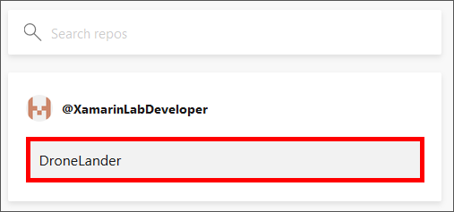
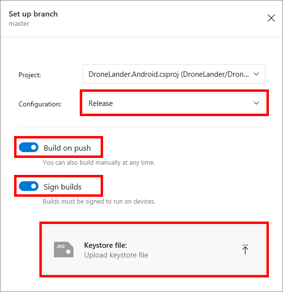
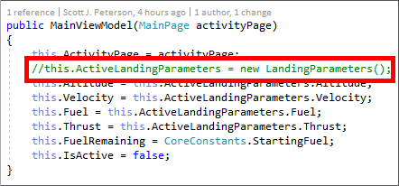
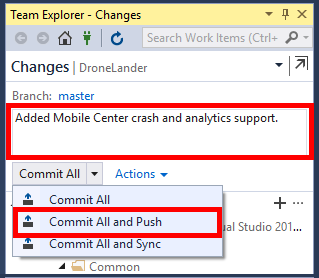
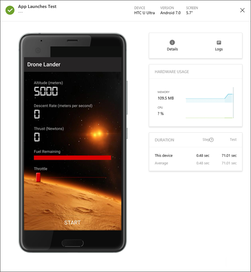

<a name="HOLTitle"></a>
# Operation Remote Resupply, Part 3 #

---

<a name="Overview"></a>
## Overview ##

One of the key challenges to maintaining and supporting mobile apps is understanding what users encounter once an app is published. No matter how perfectly you write your code, or how thorough you are about exception handling and logging, apps sometimes misbehave or even crash. When they do, you need to know what went wrong and why. [Visual Studio Mobile Center](https://www.visualstudio.com/vs/mobile-center/ "Visual Studio Mobile Center") lets you collect crash data — including full stack traces — from various devices so you can identify bugs and prioritize fixes.

Beyond crash analytics, you may want statistics regarding how many users are launching your app, where they are located, and what languages they speak. Visual Studio Mobile Center makes it easy to collect this information and more. It even allows you to collect rich behavioral analytics and answer questions such as which features are used most often, which screens are never seen, and how users utilize in-app purchases.  

Visual Studio Mobile Center can also be used to automate the build, test, and distribution process. In short, it packages essential services needed by mobile developers into a single, integrated product to help you control the development lifecycle from start to finish.

In this lab, you will use the Drone Lander app you built in previous labs to learn about the many features that Visual Studio Mobile Center has to offer, and why it should be part of the development process for every mobile app.

<a name="Objectives"></a>
### Objectives ###

In this lab, you will learn how to:

- Create a Visual Studio Mobile Center account
- Register an app with the Visual Studio Mobile Center
- Integrate the app build and distribution process with Visual Studio Mobile Center
- Add crash analytics to a Xamarin Forms app 
- View crash reports in Visual Studio Mobile Center

<a name="Prerequisites"></a>
### Prerequisites ###

The following are required to complete this lab:

- [Visual Studio Community 2017](https://www.visualstudio.com/vs/) or higher
- A computer running Windows 10 that supports hardware emulation using Hyper-V. For more information, and for a list of requirements, see https://msdn.microsoft.com/en-us/library/mt228280.aspx. 
- A GitHub account. If you don't have one, sign up for free at https://github.com/join.
- [GitHub Extension for Visual Studio](https://visualstudio.github.com/)

If you wish to build and run the iOS version of the app, you also have to have a Mac running OS X 10.11 or higher, and both the Mac and the PC running Visual Studio 2017 require further configuration. For details, see https://developer.xamarin.com/guides/ios/getting_started/installation/windows/.

---

<a name="Exercises"></a>
## Exercises ##

This lab includes the following exercises:

- [Exercise 1: Register the app with Visual Studio Mobile Center](#Exercise1)
- [Exercise 2: Add the solution to source control](#Exercise2)
- [Exercise 3: Configure Visual Studio Mobile Center for automated builds](#Exercise3)
- [Exercise 4: Integrate app builds with Visual Studio Mobile Center Distribution](#Exercise4)
- [Exercise 5: Add crash analytics support to the app](#Exercise5)
- [Exercise 6 (optional): Review launch test results](#Exercise6)
 
Estimated time to complete this lab: **45** minutes.

<a name="Exercise1"></a>
## Exercise 1: Register the app with Visual Studio Mobile Center ##
 
Before you can use Visual Studio Mobile Center to automate the build and distribution process or retrieve crash analytics, you need to create a Visual Studio Mobile Center account and register the app there. In this exercise, you will create an account and then register the Android version of Drone Lander. Visual Studio Mobile Center doesn't curently support Windows apps, but Windows support is coming soon.

1. If you don't have a GitHub account, go to https://github.com/join and sign up for one.

1. In a browser, navigate to https://mobile.azure.com/login. Once there, click **Connect with GitHub**. If you are prompted to log in, do so using your GitHub account.
 
    

    _Connecting with a GitHub account_

1. On the "Authorize application" page, click **Authorize application**.

    

    _Authorizing a GitHub connection_

2. Enter a user name for your Visual Studio Mobile Center account (or accept the default) and click **Choose username**.  

    

    _Choosing a user name_

1. Now that you have created a Visual Studio Mobile Center account, the next step is to register the Drone Lander app that you built in Labs 1 and 2. To begin, click **Add new app**. 

    

    _Adding a new app in Visual Studio Mobile Center_

1. Enter "Drone Lander" for the app name, and specify **Android** as the OS and **Xamarin** as the platform. Then click **Add new app**. 

    

    _Registering the Android version of Drone Lander_

1. Click **Xamarin.Forms** for a summary of the steps required to add the Mobile Center SDK to your app. (This is for informational purposes only at the moment. You will make these changes in the next exercise.)

    

    _Viewing Xamarin.Forms integration information_

If you would like to register the iOS of version Drone lander as well, you can do so by registering Drone Lander again, but this time specifying iOS as the operating system. You don't need to register the iOS version for this lab, but be aware that when you register a Xamarin app with Visual Studio Mobile Center, you need to register it separately for each platform that it runs on. 

<a name="Exercise2"></a>
## Exercise 2: Add the solution to source control ##

In order to take advantage of Visual Studio Mobile Center (VSMC) build integration, you must set up a remote source-code repository. VSMC supports GitHub, Bitbucket, and Visual Studio Team Services (VSTS) as source-code repositories. You will use [GitHub](https://github.com/), which is a "Git" hosting service that features a browser-based user interface, bug tracking, access control, task management, and more. In this exercise, you will create a GitHub repository for your Drone Lander solution.

1. Type "github extension" into Visual Studio 2017's "Quick Launch" window. If **GitHub extension for Visual Studio** appears under "Install," click it and follow the on-screen instructions to install GitHub Extension for Visual Studio. You will probably have to close Visual Studio to install the extension.

    

    _Installing GitHub Extension for Visual Studio_

1. In Solution Explorer, right-click the **DroneLander** solution and use the **Source Control** > **Add Solution to Source Control...** command to add the solution to a local GitHub repository.

1. Select the **GitHub** tab in Solution Explorer, and then click **Get Started**.

    

    _Starting the GitHub publishing process_
 
1. Confirm that the user name shown is the one you want to use to log in to GitHub, and then click **Publish**.

    

    _Publishing to GitHub_
 
1. In Team Explorer, click **Sync**.

    

    _Synchronizing repos_ 

1. Click **Sync** one more time to synchronize incoming and outgoing commits.

    

    _Synchronizing repos_
 
1. Confirm that the repos synced successfully.

    

    _A successful GitHub synchronization_
 
Now that Drone Lander has been added to source control and uploaded to a GitHub repository, you can configure Visual Studio Mobile Center to build it directly from there.

<a name="Exercise3"></a>
## Exercise 3: Configure Visual Studio Mobile Center for automated builds ##

With Visual Studio Mobile Center build integration, you can manage your source code in a GitHub repository and create an installable app package automatically with every commit or push. Best of all, you don't need to provision any agents or external machines to build your apps. Mobile Center takes care of this and will compile your Android (and optionally iOS) apps right from the repo with no manual setup on your side. In this exercise, you will configure Visual Studio Mobile Center to build the app from the repo you established in the previous exercise.

1. Open your Visual Studio Mobile Center apps collection by navigating to [https://mobile.azure.com/apps](https://mobile.azure.com/apps). Then click **Drone Lander for Android**.

    

    _Opening the Android version of Drone Lander_
 
1. Click **Build** in the menu on the left.

    

    _Opening the Build menu_ 

1. Click **GitHub**.
 
    

    _Selecting GitHub as the service provider_

1. Select **DroneLander** from list of repos.

	
	
	_Selecting the DroneLander repo_ 

1. Select the **master** branch in the "Branches" list and then click **Set up a branch** to configure a branch for build integration.

	
	
	_Setting up a build branch_ 

1. Change the build configuration from Debug to **Release**. Ensure that **Build on push** and **Sign builds** are enabled, and then click **Keystore file** to upload an Android keystore file. A keystore file enables signing of the Android app package (*.apk) and is required for release deployments of Android apps.

	
	
	_Configuring build branch settings_ 

1. Import the file named **DroneLanderKeystore.keystore** from this lab's "Resources\Keystore" folder

	> The keystore file you're importing was created in advance specifically for this lab. In your own development projects, you will want to create your own keystores using the Android Keystore tool available in Visual Studio 2017.

1. Enter the following values (without quotation marks) in the "Signing credentials" panel:

	- **KEYSTORE_PASSWORD** - "DroneLander"
	- **KEY_ALIAS** - "DroneLanderKeystore"
	- **KEY_PASSWORD** - "DroneLander"

	Enable **Run a launch test on device** and **Distribute build** and click **Finish Setup**.

1. Wait until you are notified that a build has been added to the queue, and then that the build has begun.

	
	
	_Notification that a build is in progress_ 

1. Wait until the build completes. Then click the **Download** button and select **Download build** from the menu to download a signed and verified Android package.

	
	
	_Downloading the package_ 

Now that Visual Studio Mobile Center is configured to build the app, a new build will be initiated each time you check in changes to the GitHub repo in a process known as *continuous integration*. Now...wouldn't it be great if each person testing the app could be notified following each successful build? Visual Studio Mobile Center can take care of that, too.

<a name="Exercise4"></a>
## Exercise 4: Integrate app builds with Visual Studio Mobile Center Distribution ##

With your first successful build in place, it's time to get your app into the hand of some testers, via the Visual Studio Mobile Center Distribute feature. Distribution is managed via simple Distribution Groups containing a set of e-mails, and are designed to communicate with testers in a way they can directly install the app their phones or other devices, similar to the way they would download an app from the app store.   

In this exercise you will be using Visual Studio Mobile Center Distribution to notify one or more testers of the availability of an app release.

1. Open Visual Studio Mobile Center to the build created in the previous exercise, or open a browser and navigate to [https://mobile.azure.com/apps](https://mobile.azure.com/apps "https://mobile.azure.com/apps") to view your apps collection and return to the build result form the previous exercise, and click **Distribute**.

	
	
	_Selecting to distribute your app release_ 

1. Select the **Collaborators** distribution group, then click **Next >**. 

	
	
	_Setting up a build branch_ 

	>The Collaborators distribution group is created automatically when you configure build services in Visual Studio Mobile Center. You can create and manage additional groups as needed.

1. Optionally, enter content under **Release notes (optional)**, such as "My first release of the awesome Drone Lander app." and click **Distribute Build**.

	After a short delay, check your email at the email address used when you created your GitHub (and therefore Visual Studio Mobile Center) account, and you should have a simple, informative message from the Visual Studio Mobile Center notifying you of a new app release:

	
	
	_A new build notification from Visual Studio Mobile Center_ 

Feel free to add more testers to the Collaborators distribution group, or even create additional groups. Remember, users can install your app directly from their device by simply clicking on the link in the email.

Now that a few users have their hands on your app, it will be helpful to know if they've installed it, how its performing for them, and most especially if the app has defects or other issues you need to address. The is where Visual Studio Mobile Center Crash Analytics come to the rescue!

<a name="Exercise5"></a>
## Exercise 5: Add crash analytics support to the app ##

The Visual Studio Mobile Center SDK makes it easy to add logic to a Xamarin Forms app to generate crash analytics. In this exercise, you will add shared and platform-specific code to Drone Lander to configure it so that crash information can be viewed in Visual Studio Mobile Center, and you will test your changes by temporarily adding code that generates an unhandled exception when the app starts up. 

1. Open the **DroneLander** solution in Visual Studio 2017, if not already open from previous exercises.

1. In Solution Explorer, right-click the **DroneLander** solution and select **Manage NuGet Packages for Solution...**. 
1. Ensure that "Browse" is selected in the NuGet Package Manager, and type "Microsoft.Azure.Mobile.Analytics" into the search box. Select the **Microsoft.Azure.Mobile.Analytics** package. Then check the **Project** box to add the package to all of the projects in the solution, and click **Install**. When prompted to review changes, click **OK**. 
1. Return to the NuGet Package Manager and once more, ensure that "Browse" is selected. Type "Microsoft.Azure.Mobile.Crashes" into the search box and select the **Microsoft.Azure.Mobile.Crashes** package. Then check the **Project** box to add the package to all of the projects in the solution, and click **Install**. When prompted to review changes, click **OK**.
1. In Solution Explorer, open the **App.xaml.cs** file in the **DroneLander (Portable)** project. 
1. Add the following statements at the top of the file:

	```C#
	using Microsoft.Azure.Mobile;
	using Microsoft.Azure.Mobile.Analytics;
	using Microsoft.Azure.Mobile.Crashes;
	```

1. Add the following code to the ```OnStart``` method:

	```C#
	 MobileCenter.Start($"android={Common.MobileCenterConstants.AndroidAppId};" +
                   $"ios={Common.MobileCenterConstants.iOSAppId}",
                   typeof(Analytics), typeof(Crashes));

1. Open "CoreConstants.cs" in the **DroneLander (Portable)** **Common** folder, and add the following class directly below the ```CoreConstants``` class:

	```C#
	public static class MobileCenterConstants
    {
        public const string AndroidAppId = "[MOBILE_CENTER_ANDROID_APP_ID]";
        public const string iOSAppId = "";
    }
	```

	
	
	_Adding MobileCenterConstants class to CoreConstants.cs_ 

	These constants will be used by Mobile Center Crash and Analytics to track use and crash information when your app starts;

1. Return to the [Visual Studio Mobile Center app portal](https://mobile.azure.com/apps) in your browser and click the Android version of **Drone Lander**.
1. Click **Manage App** in the upper-right corner of the page. 
1. Copy the value in the **App secret** box to the clipboard.
1. Return to **CoreConstants.cs** and paste to replace the value of **AndroidAppId** with the value in your clipboard.
	 
	
	
	_The updated AndroidAppId in MobileCenterConstants_ 

1. Now it's time generate a crash report and see how it looks in Visual Studio Mobile Center. To do that, you will temporarily comment out a line of code in the app to generate a crash. Begin by opening the **MainViewModels.cs** in the **DroneLander (Portable)** **ViewModels** folder.
1. Locate the assignment of **this.ActiveLandingParameters** in the ```MainViewModel``` class initializer and comment it out.

	
	
	_Commenting out the active landing parameters_

	 Since we know a drone can't start a landing without active landing parameters, this is certain to throw an exception!

1. In Solution Explorer, right-click the **DroneLander.Android** project and select **Set as StartUp Project**. 
1. Click the **Run** button to launch Drone Lander in the selected Android emulator.
1. Confirm that shortly after the app loads in the emulator, an unhandled exception is thrown. 

	
	
	_Result of an unhandled exception_

1. Crash data is initially stored on the local device, and is typically transmitted to Visual Studio Mobile Center the next time the app loads. In Visual Studio, return to **MainViewModel.cs** and uncomment the line of code that generates the unhandled exception. 
1. Use Visual Studio's **Debug** > **Start Without Debugging** command (or simply press **CTRL+F5**) to launch the app **without** the debugger attached.  

	With the new crash and analytics features added to your app, it's probably a good time to commit your changes to your source repository.

1.  Right-click the **DroneLander** solution and use the **Commit** command to commit your recent changes to GitHub.
1. Enter a comment, such as "Added Mobile Center crash and analytics support." as the commit comment, then open "Commit All" drop down and select **Commit All and Push**.

	
	
	_Committing updates to GitHub_

1. Return to the [Visual Studio Mobile Center](https://mobile.azure.com/apps) in your browser and open **Drone Lander**.
1. Click **Crashes**.
1. Observe the various charts displaying crash information, as well as the entry at the bottom of the page representing the crash that you generated moments ago. 
1. Select the crash details for **Crash Group #1** at observe the through details, including the ability to view an entire stack trace.
 
    

    _Crash reporting in Visual Studio Mobile Center_

	>Note that the crash may not appear in the portal for 10 minutes or so. If it's not there, and you have a little time, proceed to optional Exercise 6 and return to the crash reports later. 

Having near real-time crash analytics available is important for any mobile app, but Visual Studio Mobile Center isn't limited to build integration, distribution, and crash reports. It also provides back-end services for authentication, integrated testing, data syncing, and (soon) push notifications, making it a one-stop solution for building mobile apps that you can maintain and scale. For more information, see https://docs.microsoft.com/en-us/mobile-center.

<a name="Exercise6"></a>
## Exercise 6 (optional): View launch test results ##

Have some extra time and want to check out an additional feature of Visual Studio Mobile Center?  You may have noticed in Exercise 3 you enabled "Run a launch test on device" when you configured your build settings, but you never really took a look at anything in the Test area of Visual Studio Mobile Center.

Even though you haven't configured any formal tests, yet, a "start up" test was run on the app since you enabled this setting.

1. Return to the [Visual Studio Mobile Center](https://mobile.azure.com/apps) in your browser and open **Drone Lander**.
1. Select **Test** from the left-navigation menu and observe an initial test was already run successfully.

    

    _The initial launch test results_
	
1. Click anywhere in the test panel to view a detail of the test results:

    

    _The initial launch test run details_
	 
1. Click the **App Launches Test** entry in the "TESTS" panel to view detailed information, including device model, hardware version, and even a screenshot of Drone Lander after initial startup!

    

    _Detailed launch run information, including a screenshot_	

This has been a short exercise, but probably enough to whet your imagination for what's coming up in a later lab focusing on testing, and integrating testing into the build and distribution process!

<a name="Summary"></a>
## Summary ##

Build, distribution, crash reporting, and analytics are now fully integrated into your development cycle, making it easy to simply write code, push changes to your source code repo, and let Visual Studio Mobile Center do all the heavy lifting. 

You also may have noticed Visual Studio Mobile Center Test features were available in the portal as well, and were perhaps wondering how to integrate testing into your build processes. Don't worry, you will be coming back to Visual Studio Mobile Center in Part 6, specifically to cover testing. 

That's it for Part 3 of Operation Remote Resupply. In Part 4, you will modify the app to integrate with an Azure Mobile backend, including integration of authentication, data services, and even creating your own mobile APIs.