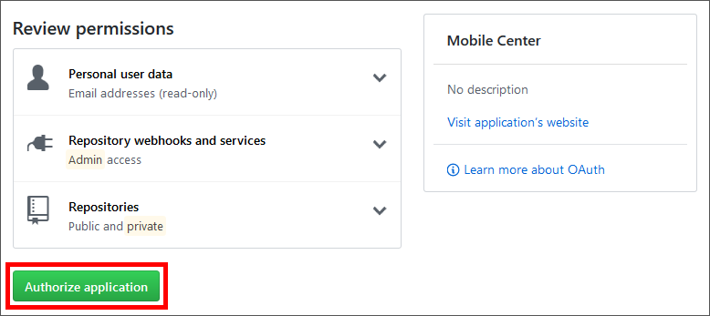
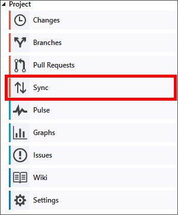
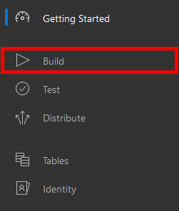
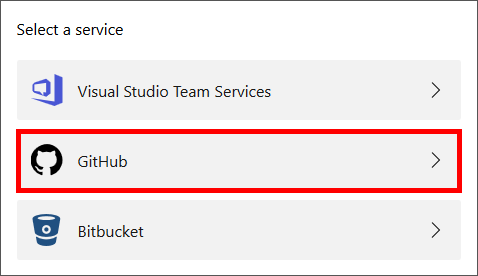
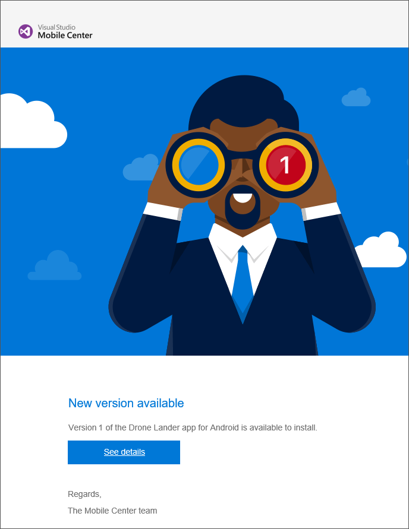
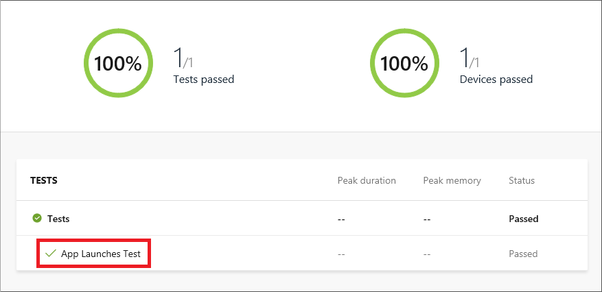

<a name="HOLTitle"></a>
# Operation Remote Resupply, Part 3 #

---

<a name="Overview"></a>
## Overview ##

One of the key challenges to maintaining and supporting mobile apps is understanding what users encounter once an app is published. No matter how perfectly you write your code, or how thorough you are about exception handling and logging, apps sometimes misbehave or even crash. When they do, you need to know what went wrong and why. [Visual Studio Mobile Center](https://www.visualstudio.com/vs/mobile-center/ "Visual Studio Mobile Center") lets you collect crash data — including full stack traces — from various devices so you can identify bugs and prioritize fixes.

Beyond crash analytics, you may want statistics regarding how many users are launching your app, where they are located, and what languages they speak. Visual Studio Mobile Center makes it easy to collect this information and more. It even allows you to collect rich behavioral analytics and answer questions such as which features are used most often, which screens are never seen, and how users utilize in-app purchases.  

Visual Studio Mobile Center can also be used to automate the build, test, and distribution process. In short, it packages essential services needed by mobile developers into a single, integrated product to help you control the development lifecycle from start to finish.

In this lab, you will use the Drone Lander app you built in previous labs to learn about the many features that Visual Studio Mobile Center has to offer, and why it should be part of the development process for every mobile app.

<a name="Objectives"></a>
### Objectives ###

In this lab, you will learn how to:

- Register an app with Visual Studio Mobile Center
- Use Visual Studio Mobile Center to automate builds
- Use Visual Studio Mobile Center to automate distribution to testers
- Add crash analytics to a Xamarin Forms app 
- View crash reports in Visual Studio Mobile Center

<a name="Prerequisites"></a>
### Prerequisites ###

The following are required to complete this lab:

- [Visual Studio Community 2017](https://www.visualstudio.com/vs/) or higher
- A computer running Windows 10 that supports hardware emulation using Hyper-V. For more information, and for a list of requirements, see https://msdn.microsoft.com/en-us/library/mt228280.aspx. 
- A GitHub account. If you don't have one, sign up for free at https://github.com/join.
- [GitHub Extension for Visual Studio](https://visualstudio.github.com/)

You won't be building the iOS version of the app during this event because doing so would require additional setup, including a Mac configured as a build host. For more information about building Xamarim Forms iOS apps, see https://developer.xamarin.com/guides/ios/getting_started/installation/windows/.

---

<a name="Exercises"></a>
## Exercises ##

This lab includes the following exercises:

- [Exercise 1: Register the app with Visual Studio Mobile Center](#Exercise1)
- [Exercise 2: Add the solution to source control](#Exercise2)
- [Exercise 3: Enable automated builds](#Exercise3)
- [Exercise 4: Enable automated distribution](#Exercise4)
- [Exercise 5: Add crash analytics support to the app](#Exercise5)
- [Exercise 6 (optional): Review launch test results](#Exercise6)
 
Estimated time to complete this lab: **45** minutes.

<a name="Exercise1"></a>
## Exercise 1: Register the app with Visual Studio Mobile Center ##
 
Before you can use Visual Studio Mobile Center to automate the build and distribution process or retrieve crash analytics, you need to create a Visual Studio Mobile Center account and register the app there. In this exercise, you will create an account and register the Android version of Drone Lander.

1. If you don't have a GitHub account, go to https://github.com/join and sign up for one.

1. In a browser, navigate to https://mobile.azure.com/login. Once there, click **Connect with GitHub**. If you are prompted to log in, do so using your GitHub account.
 
    

    _Connecting with a GitHub account_

1. On the "Authorize application" page, click **Authorize application**. If you are asked to sign in to GitHub, do so with your GitHub user name and password.

    

    _Authorizing an application_

1. If you are asked to choose a user name, enter a user name for your Visual Studio Mobile Center account (or accept the default) and click **Choose username**.  

    

    _Choosing a user name_

1. Now that you have created a Visual Studio Mobile Center account, the next step is to register the Drone Lander app that you built in Parts 1 and 2. To begin, click **Add new app**. 

    

    _Adding a new app in Visual Studio Mobile Center_

1. Enter "Drone Lander" for the app name, and specify **Android** as the OS and **Xamarin** as the platform. Then click **Add new app**. 

    

    _Registering the Android version of Drone Lander_

1. Click **Xamarin.Forms** for a summary of the steps required to add the Mobile Center SDK to your app. (This is for informational purposes only at the moment. You will make these changes in a subsequent exercise.)

    

    _Viewing Xamarin.Forms integration information_

If you would like to register the iOS of version Drone lander as well, you can do so by registering Drone Lander again, but this time specifying iOS as the operating system. You don't need to register the iOS version for this lab, but be aware that when you register a Xamarin app with Visual Studio Mobile Center, you need to register it separately for each platform that it runs on. You can also register the Windows (UWP) version if you would like, but realize that Visual Studio Mobile Center and doesn't yet support crash analytics on Windows.

<a name="Exercise2"></a>
## Exercise 2: Add the solution to source control ##

In order to take advantage of Visual Studio Mobile Center (VSMC) build integration, you must set up a remote source-code repository. VSMC supports [GitHub](https://github.com/), [Bitbucket](https://bitbucket.org/), and [Visual Studio Team Services](https://www.visualstudio.com/team-services/) (VSTS) as repositories. You will use GitHub, which is a Git hosting service that features a browser-based user interface, bug tracking, access control, task management, and more. In this exercise, you will create a GitHub repository for your Drone Lander solution.

1. Type "github extension" into Visual Studio 2017's Quick Launch window. If **GitHub extension for Visual Studio** appears under "Install," click it and follow the on-screen instructions to install GitHub Extension for Visual Studio. You will probably have to close Visual Studio to install the extension.

    

    _Installing GitHub Extension for Visual Studio_

1. In Solution Explorer, right-click the **DroneLander** solution and use the **Source Control** > **Add Solution to Source Control...** command to add the solution to a local GitHub repository.

1. Select the **GitHub** tab in Solution Explorer, and then click **Get Started**.

    

    _Starting the GitHub publishing process_
 
1. Confirm that **GitHub** is selected and that your GitHub user name is shown, and then click **Publish**.

    

    _Publishing to GitHub_
 
1. In Team Explorer, click **Sync**.

    

    _Synchronizing repos_ 

1. Click **Sync** one more time to synchronize incoming and outgoing commits.

    

    _Synchronizing repos_
 
1. Confirm that the repos synced successfully.

    

    _A successful GitHub synchronization_
 
Now that Drone Lander has been added to source control and uploaded to a GitHub repository, you can configure Visual Studio Mobile Center to build it directly from there.

<a name="Exercise3"></a>
## Exercise 3: Enable automated builds ##

With Visual Studio Mobile Center's build feature, you can store your source code in a GitHub repository and create an installable app package automatically with every commit or push — a process known as *continuous integration*. Best of all, you don't need to provision any agents or external machines to build your apps. Mobile Center takes care of this and will compile your iOS, Android, and Windows apps right from the repo with no manual setup on your side. In this exercise, you will configure Visual Studio Mobile Center to build the app from the repo you established in the previous exercise.

1. Open your Visual Studio Mobile Center apps collection by navigating to [https://mobile.azure.com/apps](https://mobile.azure.com/apps). Then click **Drone Lander for Android**.

    

    _Opening the Android version of Drone Lander_
 
1. Click **Build** in the menu on the left.

    

    _Opening the Build menu_ 

1. Click **GitHub**.
 
    

    _Selecting GitHub as the service provider_

1. Select **DroneLander** from the list of repos.

	
	
	_Selecting the DroneLander repo_ 

1. Select the **master** branch from the list of branches, and then click **Set up a branch** to configure a branch for build integration.

	
	
	_Setting up a build branch_ 

1. Change the build configuration from Debug to **Release**. Ensure that **Build on push** and **Sign builds** are enabled, and then click **Keystore file** to upload an Android keystore file. A keystore file enables signing of the Android app package (*.apk) and is required for release deployments of Android apps.

	
	
	_Configuring build branch settings_ 

1. Import the file named **DroneLanderKeystore.keystore** from this lab's "Resources\Keystore" folder

	> The keystore file you're importing was created in advance specifically for this lab. In your own development projects, you will want to create your own keystores using the Android Keystore tool available in Visual Studio 2017.

1. Enter the following values (without quotation marks) in the "Signing credentials" panel:

	- **KEYSTORE_PASSWORD** - "DroneLander"
	- **KEY_ALIAS** - "DroneLanderKeystore"
	- **KEY_PASSWORD** - "DroneLander"

	Enable **Run a launch test on device** and **Distribute build** and click **Finish Setup**.

1. Wait until you are notified that a build has been added to the queue, and then that the build has begun.

	
	
	_Notification that a build is in progress_ 

1. Wait until the build completes. Then click the **Download** button and select **Download build** from the menu to download a signed and verified Android package.

	
	
	_Downloading the package_ 

Now that Visual Studio Mobile Center is configured to build the app, a new build will be initiated each time you check in changes to the GitHub repo. Now...wouldn't it be great if each person testing the app could be notified following each successful build? Visual Studio Mobile Center can help with that, too.

<a name="Exercise4"></a>
## Exercise 4: Enable automated distribution ##

In this exercise, you will configure Visual Studio Mobile Center to send e-mail notifications to a group of collaborators each time a new build is created. The e-mails will include a link that each tester can use use to the download the app and install it on his or her device. 

1. Return to the build created in the previous exercise and click **Distribute**.

	
	
	_Configuring build distributions_ 

1. Select the **Collaborators** distribution group, and then click **Next**. 

	> The Collaborators group is created automatically when you configure build services in Visual Studio Mobile Center. You can create additional groups if desired, and you can add e-mail addresses to the Collaborators groups and to groups that you create.

	
	
	_Selecting a distribution group_ 

1. Optionally enter a short release note such as "My first release of Drone Lander." Then click **Distribute Build**.

1. Check your e-mail and confirm that you received a message notifying you of a new release.

	
	
	_Build notification from Visual Studio Mobile Center_ 

Feel free to add more testers to the Collaborators distribution group, or to create additional groups. Remember, users can install your app on their devices by simply clicking on the link in the email.

<a name="Exercise5"></a>
## Exercise 5: Add crash analytics support to the app ##

In a perfect world, apps would never crash. In the real world, they sometimes do. The Visual Studio Mobile Center SDK makes it easy to add logic to a Xamarin Forms app to generate helpful analytics when crashes occur. In this exercise, you will add code to Drone Lander to configure it so that crash information can be viewed in Visual Studio Mobile Center, and you will test your changes by temporarily modifying your code to generate an unhandled exception when the app starts up. 

1. Open the **DroneLander** solution in Visual Studio 2017 if it isn't already open. In Solution Explorer, right-click the solution and select **Manage NuGet Packages for Solution...**.

1. Ensure that "Browse" is selected in the NuGet Package Manager, and type "Microsoft.Azure.Mobile.Analytics" into the search box. Select the **Microsoft.Azure.Mobile.Analytics** package. Then check the **Project** box to add the package to all of the projects in the solution, and click **Install**. When prompted to review changes, click **OK**. 

1. Return to the NuGet Package Manager and once more ensure that "Browse" is selected. Type "Microsoft.Azure.Mobile.Crashes" into the search box and select the **Microsoft.Azure.Mobile.Crashes** package. Then check the **Project** box to add the package to all of the projects in the solution, and click **Install**. When prompted to review changes, click **OK**.

1. In Solution Explorer, open **App.xaml.cs** in the **DroneLander (Portable)** project. Then add the following statements at the top of the file:

	```C#
	using Microsoft.Azure.Mobile;
	using Microsoft.Azure.Mobile.Analytics;
	using Microsoft.Azure.Mobile.Crashes;
	```

1. Add the following code to the ```OnStart``` method:

	```C#
	 MobileCenter.Start($"android={Common.MobileCenterConstants.AndroidAppId};" +
                   $"ios={Common.MobileCenterConstants.iOSAppId}",
                   typeof(Analytics), typeof(Crashes));

1. Open **CoreConstants.cs** in the **DroneLander (Portable)** project's "Common" folder, and add the following class directly below the ```CoreConstants``` class:

	```C#
	public static class MobileCenterConstants
    {
        public const string AndroidAppId = "MOBILE_CENTER_ANDROID_APP_ID";
        public const string iOSAppId = "";
    }
	```

	These constants will be used by Mobile Center to track usage and crash information when your app starts.

1. Return to [Visual Studio Mobile Center](https://mobile.azure.com/apps) in your browser and open the Android version of **Drone Lander**.

1. Click **Manage App** in the upper-right corner of the page. 

1. Copy the value in the **App secret** box to the clipboard.

1. Return to **CoreConstants.cs** and replace MOBILE_CENTER_ANDROID_APP_ID with the value on the clipboard.
	 
	
	
	_Updating the Android App ID_ 

1. Now it's time generate a crash report and see how it looks in Visual Studio Mobile Center. To do that, you will temporarily comment out a line of code in the app to generate a crash. Begin by opening **MainViewModels.cs** in the **DroneLander (Portable)** project's "ViewModels" folder. Then comment out the line of code that initializes ```this.ActiveLandingParameters``` in the ```MainViewModel``` constructor.

	
	
	_Commenting out a line of code to induce a crash_

1. Launch the Android version of Drone Lander in the debugger. Confirm that the app throws an unhandled exception when it starts. 

	
	
	_The unhandled exception_

1. Crash data is initially stored on the local device, and is typically transmitted to Visual Studio Mobile Center the next time the app loads. In Visual Studio, return to **MainViewModel.cs** and uncomment the line of code that generates the unhandled exception. Use Visual Studio's **Debug** > **Start Without Debugging** command (or simply press **CTRL+F5**) to launch the app **without** the debugger attached. This will transmit the crash information stored on the local device to VSMC.

1. Since you modified the Drone Lander code, now is a good time to commit the changes and sync with GitHub. Right-click the **DroneLander** solution and use the **Commit** command to commit your changes.

1. Enter a comment such as "Added Mobile Center crash and analytics support." Then select **Commit All and Push** from the **Commit All** drop-down.

	
	
	_Committing updates to GitHub_

1. Return to the [Visual Studio Mobile Center](https://mobile.azure.com/apps) in your browser and open **Drone Lander**.

1. Click **Crashes** and take a moment to examine the various charts displaying crash information, as well as the entry at the bottom of the page representing the crash that occurred moments ago. 

	> The crash may not appear in the portal for 10 minutes or so. If it's not there, proceed to Exercise 6 and return to the crash reports later. 

1. Select the crash details for **Crash Group #1** and examine the stack trace for the crash that occurred. The stack trace identifies the ```MainViewModel``` constructor as the source of the crash, and ```System.NullReferenceException``` as the type of exception.
 
    

    _Crash reporting in Visual Studio Mobile Center_

You have seen first-hand how Visual Studio Mobile Center supports automated builds and distribution and provides rich crash analytics. But this isn't all VSMC can do. It also provides back-end services for authenticating users and supports integrated testing, data syncing, and (soon) push notifications. For more information on VSMC and its various features, see https://docs.microsoft.com/en-us/mobile-center.

<a name="Exercise6"></a>
## Exercise 6 (optional): View launch test results ##

Have some extra time and want to learn about an additional feature of Visual Studio Mobile Center?  In Exercise 3, you enabled **Run a launch test on device** when you configured your build settings, but you never did anything to utilize that setting. In this exercise, you will learn what that setting does and how you can view the information that it generates.

1. Return to the [Visual Studio Mobile Center](https://mobile.azure.com/apps) in your browser and open **Drone Lander**.

1. Select **Test** from the menu on the left and confirm that a test was run when the app launched, and that the test ran successfully.

    

    _The launch test results_
	
1. Click anywhere in the test panel to view a detail of the test results. Then click **App Launches Test**.

    

    _Viewing the test results_
	 
1. Examine the results of the test, which includes an indicator of how much RAM the app consumed and even a screen shot of the app itself.

    

    _Detailed launch-test information_	

This merely scratches the surface of what you can do with VSMC when it comes to testing. You will learn more about integration testing in Part 6, and learn how to include comprehensive tests in the build and distribution process.

<a name="Summary"></a>
## Summary ##

That's it for Part 3 of Operation Remote Resupply. In Part 4, you will build an Azure back-end and modify the app to use it. Along the way, you will learn how to authenticate users, employ Azure data services, and even create your own mobile APIs.