<a name="HOLTitle"></a>
# Operation Remote Resupply, Part 4 #

---

<a name="Overview"></a>
## Overview ##

The challenges of mobile development can be daunting to even the most experienced developer. Mobile apps need to store data, and most users want their information available all the time, whether online or offline. Mobile apps need authentication and authorization to ensure the integrity and privacy of the data being sent, and modern mobile apps need an intuitive and reliable framework for real-time user notification and communication that can seamlessly broadcast information across a huge variety of platform variations and devices.

To meet these ever-increasing challenges, [Azure Mobile Apps](https://azure.microsoft.com/en-us/services/app-service/mobile/ "Azure Mobile Apps") offer a highly scalable, globally available mobile application development platform for developers that expose a rich set of capabilities such as authentication, authentication, data storage, and even offline synchronization and push notification.

In this lab, you will use Visual Studio 2017 and Azure Mobile Apps services to provision and configure a mobile backend service to provide an authenticated user sign-in experience, as well as add features to your app to record drone landing attempt history and send real-time telemetry information to Mission Control.

<a name="Objectives"></a>
### Objectives ###

In this lab, you will learn how to:

- Create an Azure Mobile App
- Create an Azure Mobile backend service
- Add Mobile App authentication to a Xamarin Forms app
- Add Mobile App authentication to a backend service
- Call Mobile App backend services from a Xamarin Forms app

<a name="Prerequisites"></a>
### Prerequisites ###

The following are required to complete this lab:

- [Visual Studio Community 2017](https://www.visualstudio.com/vs/) or higher
- A computer running Windows 10 that supports hardware emulation using Hyper-V. For more information, and for a list of requirements, see https://msdn.microsoft.com/en-us/library/mt228280.aspx. 
- An active Microsoft Azure subscription. If you don't have one, [sign up for a free trial](http://aka.ms/WATK-FreeTrial)

If you wish to build and run the iOS version of the app, you also have to have a Mac running OS X 10.11 or higher, and both the Mac and the PC running Visual Studio 2017 require further configuration. For details, see https://developer.xamarin.com/guides/ios/getting_started/installation/windows/.

---

<a name="Exercises"></a>
## Exercises ##

This lab includes the following exercises:

- [Exercise 1: Create an Azure Mobile App](#Exercise1)
- [Exercise 2: Add a data connection](#Exercise2)
- [Exercise 3: Implement and deploy a back-end service](#Exercise3)
- [Exercise 4: Register the service and enable authentication](#Exercise4)
- [Exercise 5: Add Mobile App authentication support to a Xamarin Forms app](#Exercise5)
- [Exercise 6: Call Mobile App services from a Xamarin Forms app](#Exercise6)
- [Exercise 7 (optional): Send telemetry to Mission Control](#Exercise7)
 
Estimated time to complete this lab: **45** minutes.

<a name="Exercise1"></a>
## Exercise 1: Create an Azure Mobile App ##
 
An Azure Mobile App is a back-end service for mobile apps. You have already create the "client" side of a mobile app previous labs, using Xamarin Forms, and although Drone Lander is a complete, fully functioning app, there are no services available for storing data or authenticating users. An Azure Mobile App is a highly scalable, globally available mobile application development platform for mobile developers that delivers these features, with services such as data storage, authorization and authentication, and even offline storage and push notifications built right in.

In this exercise you will create an Azure Mobile App to serve as the foundation for your Drone Lander app backend. 

1. Open the [Azure Portal](https://portal.azure.com) in your browser. If asked to log in, do so using your Microsoft account.

1. Click **+ New**, followed by **Web + Mobile** and **Mobile App**.

1. Enter an app name that is unique within Azure, such as "dronelandermobile001." Under **Resource Group**, select **Create new** and enter "DroneLanderResourceGroup" as the resource-group name to create a resource group for the Mobile App. Accept the default values for all other parameters. Then click **Create** to create a new Mobile App.
    
	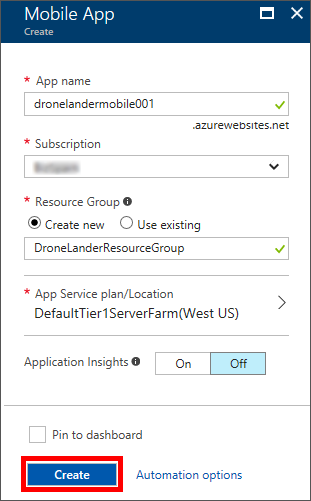

    _Creating a new Azure Mobile App_

1. Click **Resource groups** in the ribbon on the left side of the portal, and then click **DroneLanderResourceGroup** to open the resource group.

1. Click the **Refresh** button periodically until "Deploying" changes to "Succeeded," indicating that the Mobile App has been deployed.
 
That's it, it's that quick. Although you have a new Mobile App created, it doesn't do much yet, and is really more of a "placeholder" at the moment. In the next exercise you will be adding support for data storage services via Azure Mobile "Easy" table and API support.

<a name="Exercise2"></a>
## Exercise 2: Add a data connection ##

Every front end needs a great backend, and in mobile app development it’s important to have your data available at all times. Integrated with Azure Mobile Apps are the concepts of "Easy" tables and APIs, as well as direct data connections, that easily connect your mobile app backend services to data storage, as well as enable integrated authentication you will add later in this lab.

Azure Mobile data connections are "backended" by either Azure SQL Database or Azure Storage. In this exercise you will be configuring your Azure Mobile App to use Azure SQL Database.

1. In the blade for the "DroneLanderResourceGroup" resource, click the Mobile App service that you deployed in Exercise 1. Then scroll down in the menu on the left side of the blade and click **Data connections**.

	

    _Viewing data connections_
 
1. Click **+ Add** to add a new data connection.
 
1. Ensure **SQL Database** is selected. Then click **Configure required settings**, followed by **Create a new database**.

	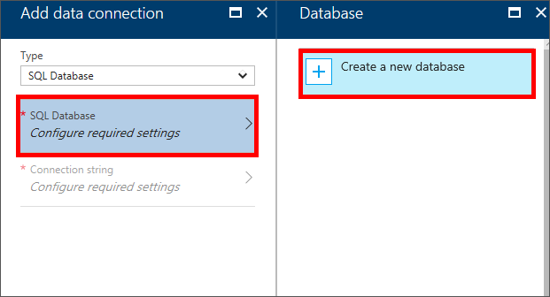

    _Creating a new database_
 
1. Enter the name of your Mobile App as the database name, and then click **Target Server**.

	> Using the same name for your Mobile App and SQL database is NOT a requirement. It is simply a convenience for working this lab.

	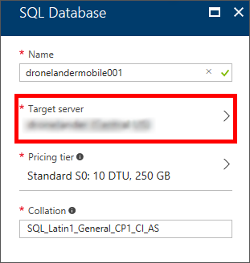

    _Naming a database_
 
1. Click **Create a new server** and enter "dronelandermobile001" as the server name. Enter a user name and password of your choosing for accessing the server, and then click **Select**.

1. Click the **Select** button at the bottom of the "SQL Database" blade. Then click **Connection string** in the "Add data connection" blade, **OK** at the bottom of the "Connection String" blade, and **OK** at the bottom of the "Add data connection" blade.

	> Since you will be working with a "Quick Start" backend service in the next exercise, it's important that you accept the default connection string name of "MS_TableConnectionString."

	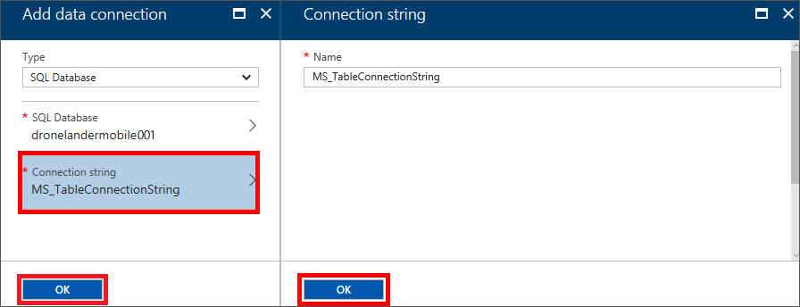

    _Adding a data connection_
 
Provisioning the database and database server will take a few minutes, but there's no need to wait. You can move on the next exercise and begin writing the code to connect the Drone Lander app to the Azure Mobile App.

<a name="Exercise3"></a>
## Exercise 3: Implement and deploy a back-end service ##

Although an Azure Mobile App is, in many ways, just a placeholder service, much of the complexity of working with backend services is handled for you, centrally, in the Azure Mobile App service itself, like managing connection strings and authentication providers. Allowing an Azure Mobile App to manage these tricky pieces has clear advantages, and allows a developer to focus primarily on writing code for business logic and features, instead of worrying about configuration and administration.

In this exercise you will be creating an Azure Mobile Backend using an Azure Mobile App "Quick Start" project you will add to your Drone Lander solution, and then writing code to take advantage of the built-in Mobile table and API features of Azure Mobile Apps.

1. In Visual Studio 2017, open the **DroneLander** solution that you built in previous labs.

1. Right-click the **DroneLander** solution and use the **Add** > **Existing Project...** command to add **DroneLander.Backend.csproj** from the lab's "Resources\Quick Start\DroneLander.Backend" folder. This is a quick-start project for creating a back-end service to be hosted in the Azure Mobile App you created in Exercise 1.

	> You can click **Quickstart** in the blade for an Azure Mobile App in the Azure Portal and download quick-start projects of various types. Because these projects contain infrastructure you don't need and would have to be modified anyway, you are importing a project that has been specifically prepared for this lab.
 
	

    _The DroneLander solution with the quick-start project added_

1. Right-click the "Controllers" folder in the **DroneLander.Backend** project and use the **Add** > **Class** command to add a class file named "ActivityItemController.cs." Then replace the contents of the file with the following code:

	```C#
	using System.Linq;
	using System.Threading.Tasks;
	using System.Web.Http;
	using System.Web.Http.Controllers;
	using System.Web.Http.OData;
	using Microsoft.Azure.Mobile.Server;
	using DroneLander.Service.Models;
	using DroneLander.Service.DataObjects;
	
	namespace DroneLander.Service.Controllers
	{
	    public class ActivityItemController : TableController<ActivityItem>
	    {
	        protected override void Initialize(HttpControllerContext controllerContext)
	        {
	            base.Initialize(controllerContext);
	            DroneLanderServiceContext context = new DroneLanderServiceContext();
	            DomainManager = new EntityDomainManager<ActivityItem>(context, Request);
	        }
	
	        // GET tables/ActivityItem
	        public IQueryable<ActivityItem> GetAllActivityItems()
	        {
	            return Query();
	        }
	
	        // GET tables/ActivityItem/48D68C86-6EA6-4C25-AA33-223FC9A27959
	        public SingleResult<ActivityItem> GetActivityItem(string id)
	        {
	            return Lookup(id);
	        }
	
	        // PATCH tables/ActivityItem/48D68C86-6EA6-4C25-AA33-223FC9A27959
	        public Task<ActivityItem> PatchActivityItem(string id, Delta<ActivityItem> patch)
	        {
	            return UpdateAsync(id, patch);
	        }
	
	        // POST tables/ActivityItem
	        public async Task<IHttpActionResult> PostActivityItem(ActivityItem item)
	        {
	            ActivityItem current = await InsertAsync(item);
	            return CreatedAtRoute("Tables", new { id = current.Id }, current);
	        }
	
	        // DELETE tables/ActivityItem/48D68C86-6EA6-4C25-AA33-223FC9A27959
	        public Task DeleteActivityItem(string id)
	        {
	            return DeleteAsync(id);
	        }
	    }
	}
	```

	This controller uses the data connection you created in the previous exercise to access an "ActivityItem" table in the database. ```ActivityItemController``` derives from ```TableController```, which provides a base implementation for controllers in Azure Mobile Apps and makes it easy to perform create, read, update, and delete (CRUD) operations on data stores connected to those apps.

1. Right-click the "Controllers" folder again and use the **Add** > **Class** command to add a class file named "TelemetryController.cs." Then replace the contents of the file with the following code:

	```C#
	using System.Web.Http;
	using System.Web.Http.Tracing;
	using Microsoft.Azure.Mobile.Server;
	using Microsoft.Azure.Mobile.Server.Config;
	using System.Threading.Tasks;
	using DroneLander.Service.DataObjects;
	
	namespace DroneLander.Service.Controllers
	{    
	    [MobileAppController]
	    public class TelemetryController : ApiController
	    {
	        // GET api/telemetry
	        public string Get()
	        {
	            MobileAppSettingsDictionary settings = this.Configuration.GetMobileAppSettingsProvider().GetMobileAppSettings();
	            
	            string host = settings.HostName ?? "localhost";
	            string greeting = $"Hello {host}. You are currently connected to Mission Control";
	           
	            return greeting;
	        }
	
	        // POST api/telemetry
	        public async Task<string> Post(TelemetryItem telemetry)
	        {
	            await Helpers.TelemetryHelper.SendToMissionControlAsync(telemetry);
	            return $"Telemetry for {telemetry.UserId} received by Mission Control.";
	        }
	    }
	}
	```

	Note the ```[MobileAppController]``` attribute decorating the class definition. This attribute designates an ```ApiController``` as an Azure Mobile App controller, meaning it can be accessed through the Azure Mobile SDK using standard APIs. The Telemetry Controller is responsible for sending real-time telemetry to Earth-based Mission Control to monitor the progress of landing attempts. 
 
1. To ensure that your transmissions are properly routed to Mission Control, you need to insert the mission event name. Open **CoreConstants.cs** in the "Common" folder of the **DroneLander.Backend** project, locate the field named ```MissionEventName```, and replace "[ENTER_MISSION_EVENT_NAME]" with the value given to you at the start of the event.

	

    _Updating the mission event name_

1. The next step is to publish the service to the cloud. Right-click the **DroneLander.Backend** project and select **Publish...** from the context menu. Then choose **Select Existing** and click **Publish**. 

	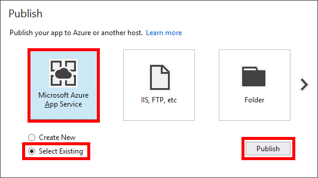

    _Publishing an Azure Mobile App_ 

1. Select the Azure Mobile App you created in Exercise 1. Then click **OK** to begin the publishing process. 
 
1. Wait until your browser opens to the default Azure Mobile App landing page, indicating that the service was successfully deployed.

	

    _The default Azure Mobile App landing page_ 

Your mobile backend is now in place, including the ability to read and write landing activity and send telemetry to Mission Control. There's only one problem: anyone can read and write your landing data, and use your telemetry API if they get their hands on the mobile service address. This might be fine in testing, but certainly not in production, and especially not with so many other astronauts counting on you.

In the next exercise you will add authorization and authentication to your backend service to make certain only authorized users can access it.

<a name="Exercise4"></a>
## Exercise 4: Register the service and enable authentication ##

One of the advantages of using Azure Mobile App authentication is that your authentication services and processes can easily be centralized and managed in a single location, without requiring any code changes in the app backend. This provides an easy way to protect your app data, as well as work with user-specific data.

Azure Mobile Apps use the same authentication as any other Azure App Service, via federated identity provides, in which a 3rd-party identity provider ("IDP") stores accounts and authenticates users, and the app uses this identity instead of its own. Azure Mobile Apps support five identity providers out of the box: Azure Active Directory, Facebook, Google, Microsoft Account, and Twitter. You can also expand this support for your apps by integrating another identity providers, or even your own custom identity solutions.

In this exercise, you will create a Microsoft App registration and adding code to the Drone Lander backend service to require Microsoft account authentication prior to accessing the activity and telemetry services you created in the previous exercise.
 
1. Navigate to the [Microsoft Application Registration portal](https://apps.dev.microsoft.com/) in your browser and sign in with your Microsoft account.

1. Click **Add an app** at the top of the "Live SDK applications" section.

	

    _Registering an app_ 

1. Enter "Drone Lander" as the app name and click **Create Application**.

1. Scroll down and click the **Add URL** button next to "Redirect URLs." Then enter the following URL, replacing "[YOUR_MOBILE_APP_NAME]" with the name of the Azure Mobile App you created in Exercise 1. 

	```
	https://[YOUR_MOBILE_APP_NAME].azurewebsites.net/.auth/login/microsoftaccount/callback
	```

	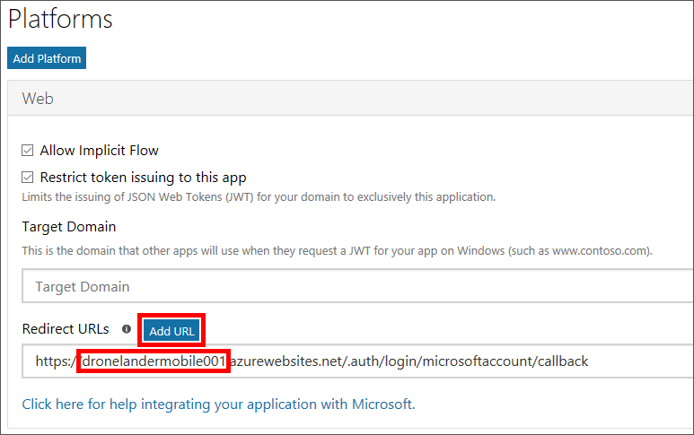

    _Adding a redirect URL_ 

1. Click the **Save** button at the bottom of the page. 

	

    _Saving registration changes_ 

1. Scroll to the top of the page and copy the application ID and the application secret into Notepad or your favorite text editor.

	

    _Copying the application ID and application secret_ 

1. Return to the [Azure Portal](https://portal.azure.com) and to the blade for the Azure Mobile App you created in Exercise 1. Click **Authentication / Authorization** in the menu on the left. Then turn "App Service Authentication" **On** and select **Microsoft** from the list of authentication providers.  

	

    _Selecting the Microsoft authentication provider_ 

1. Paste the application ID into the **Client Id** and the application secret into the **Client Secret** field in the "Microsoft Account Authentication Settings" blade. Make sure the values you entered do not have any leading or trailing spaces, and then click **OK**.

	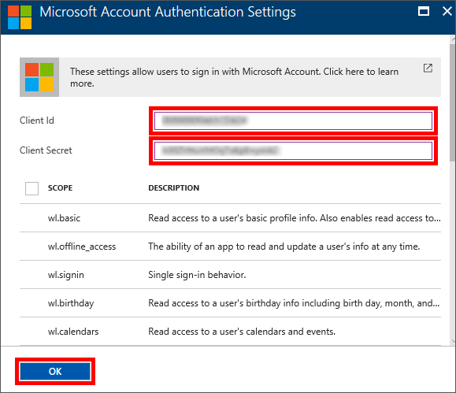

    _Entering client secrets_ 

1. Click **Save** at the top of the blade for the Azure Mobile to save the settings that you just entered.

1. Azure Mobile App authentication can be applied at any level, from an entire mobile service to a single method. You will apply it at the class level by adding special attributes to the controller classes you created in the previous exercise.

	Return to the DroneLander solution in Visual Studio 2017. Open **ActivityItemController.cs** in the **DroneLander.Backend** project's "Controllers" folder and locate the ```ActivityItemController``` class near the top of the file. Then add an ```[Authorize]``` attribute to the class:

	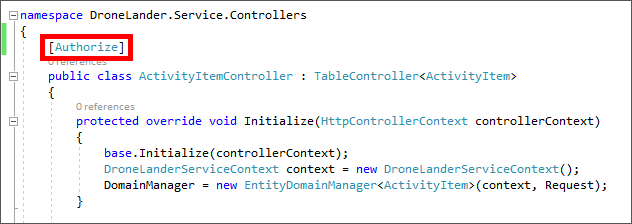

    _Attributing the controller class_ 

1. Open **TelemetryController.cs** and add an ```[Authorize]``` attribute to the ```TelemetryController``` class, directly above the ```[MobileAppController]``` attribute that is already there.

1. Right-click the **DroneLander.Backend** project and use the **Publish...** command to publish your changes to Azure.

With Azure Mobile App authentication in place, and your backend service updated and published to require authorization, the next step is to update your Xamarin Forms projects to support mobile authentication and authorization flow, using the Azure Mobile SDK.

<a name="Exercise5"></a>
## Exercise 5: Add Mobile App authentication support to a Xamarin Forms app ##

By using the Azure Mobile SDK, users can sign in to an experience that integrates with the operating system that the app is running on, creating an appropriate experience whether user is signing in on Android, iOS, or Windows. Using the SDK also makes it simple for you to receive a provider token and additional information on the client, making it much easier to customize the user experience if necessary. This process is commonly referred to as a "client flow" or "client-directed flow" since code on the client signs in users, and the client code has access to a provider token.

In this exercise you will be adding a sign in and authentication experience to your Drone Lander projects using the Azure Mobile App SDK, by adding and accessing a platform-specific code in each project.

1. Open the **DroneLander** solution in Visual Studio 2017, if not already open from previous exercises, then right-click the solution and select **Manage NuGet Packages for Solution...**. 

1. Ensure that "Browse" is selected in the NuGet Package Manager, and type "Microsoft.Azure.Mobile.Client" into the search box. Select the **Microsoft.Azure.Mobile.Client** package. Then check the **Project** box to add the package to all of the projects in the solution, and click **Install**. When prompted to review changes, click **OK**. 

1. Open "CoreConstants.cs" in the **DroneLander (Portable)** **Common** folder, and add the following class directly below the ```CoreConstants``` class, replacing the value "[YOUR_MOBILE_APP_NAME]" with the name of the Azure Mobile App created in Exercise 1, such as "dronelandermobile001".

	```C#
	public static class MobileServiceConstants
    {
        public const string AppUrl = "https://[YOUR_MOBILE_APP_NAME].azurewebsites.net";
    }
	```

	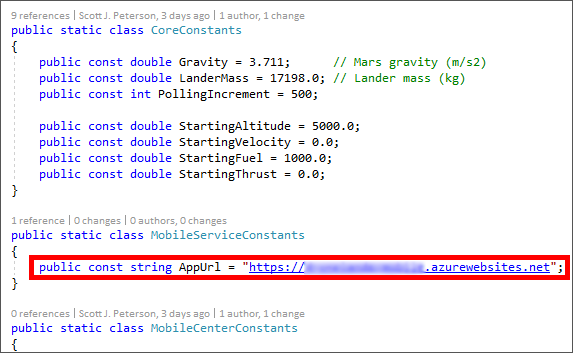
	
	_Adding MobileServiceCostants class to CoreConstants.cs_ 

	This constant will be used by the Azure Mobile SDK to specify the location of your mobile service.

1. Right-click the **DroneLander (Portable)** project and use the **Add** > **New Folder** command to add a folder named "Data" to the project, then right-click the "Data" folder that you just added and use the **Add** > **Class** command to add a class file named "TelemetryManager.cs." Then replace the current class definition with the following code:

	```C#
	using System;
	using System.Collections.Generic;
	using System.Collections.ObjectModel;
	using System.Diagnostics;
	using System.Linq;
	using System.Text;
	using System.Threading.Tasks;
	using Microsoft.WindowsAzure.MobileServices;
	using DroneLander.Data;

	namespace DroneLander
	{
	    public partial class TelemetryManager
	    {
	        static TelemetryManager defaultInstance = new TelemetryManager();
	        MobileServiceClient client;
	
	        private TelemetryManager()
	        {
	            this.client = new MobileServiceClient(Common.MobileServiceConstants.AppUrl);
	        }
	
	        public static TelemetryManager DefaultManager
	        {
	            get
	            {
	                return defaultInstance;
	            }
	            private set
	            {
	                defaultInstance = value;
	            }
	        }
	
	        public MobileServiceClient CurrentClient
	        {
	            get { return client; }
	        }
	 
	    }
	}
	```
 
	The TelemetryManager will be act as a type of "helper" class to make it easy for you to access Azure SDK methods, including authentication services, from platform-specific code.

1. Right-click the **Services** folder in the **DroneLander (Portable)** project and use the **Add** > **Class** command to add a class file named "IAuthenticationService.cs." Then replace the current class definition with the following code:

	```C#
	public interface IAuthenticationService
    {
        Task<bool> SignInAsync();
        Task<bool> SignOutAsync();
    }
	```
1. Still in the **DroneLander (Portable)** project, open **App.xaml.cs** and add the following code directly above the ```App``` class initializer to provide authentication initialization:

	```C#
	public static IAuthenticationService Authenticator { get; private set; }

    public static void InitializeAuthentication(IAuthenticationService authenticator)
    {
        Authenticator = authenticator;
    }
	```

	
	
	_Adding authentication initialization to the Portable project_ 

1.  Open **MainActivity.cs** in the **DroneLander.Android** project and add the following using statements to the top of the file:

	```C#
	using Microsoft.WindowsAzure.MobileServices;
	using System.Threading.Tasks;
	using DroneLander.Services;
	```

1. Still in **MainActivity.cs**, update the ```MainActivity``` class definition to implement the ```IAuthenticationService``` interface by adding the following code (including the leading comma) to the end of the class definition:

	```C#
	, IAuthenticationService
	```

1. Replace the entire ```OnCreate``` method with the following code, which includes new ```SignInAsync``` and ```SignOutAsync``` methods to initialize authentication and provide a mechanism to sign in and out of the mobile service:

	```C#
	protected override void OnCreate(Bundle bundle)
    {
        TabLayoutResource = Resource.Layout.Tabbar;
        ToolbarResource = Resource.Layout.Toolbar;

        base.OnCreate(bundle);

        App.InitializeAuthentication((IAuthenticationService)this);

        global::Xamarin.Forms.Forms.Init(this, bundle);
        LoadApplication(new App());
    }

    MobileServiceUser user = null;

    public async Task<bool> SignInAsync()
    {
        bool isSuccessful = false;

        try
        {
            user = await TelemetryManager.DefaultManager.CurrentClient.LoginAsync(this, MobileServiceAuthenticationProvider.MicrosoftAccount);
            isSuccessful = user != null;
        }
        catch { }

        return isSuccessful;
    }

    public async Task<bool> SignOutAsync()
    {
        bool isSuccessful = false;

        try
        {
            await TelemetryManager.DefaultManager.CurrentClient.LogoutAsync();
            isSuccessful = true;
        }
        catch { }

        return isSuccessful;
    }
	```

	This platform-specific code provides everything necessary for Azure Mobile App sign in and sign out on an Android device, and it's just as simple for both iOS and Windows:

	To add Azure Mobile App sign in and sign out services for iOS:

1. Open **AppDelegate.cs** in the **DroneLander.iOS** project and add the following using statements to the top of the file:

	```C#
	using Microsoft.WindowsAzure.MobileServices; 
	using System.Threading.Tasks;
	using DroneLander.Services;
	```
1. Still in **AppDelegate.cs**, update the ```AppDelegate``` class definition to implement the ```IAuthenticationService``` interface by adding the following code (including the leading comma) to the end of the class definition:

	```C#
	, IAuthenticationService
	```

1. Replace the entire ```FinishedLaunching``` method with the following code:

	```C#
	public override bool FinishedLaunching(UIApplication app, NSDictionary options)
    {
        App.InitializeAuthentication((IAuthenticationService)this);

        global::Xamarin.Forms.Forms.Init();
        LoadApplication(new App());

        return base.FinishedLaunching(app, options);
    }

    MobileServiceUser user = null;

    public async Task<bool> SignInAsync()
    {
        bool successful = false;

        try
        {
            user = await TelemetryManager.DefaultManager.CurrentClient.LoginAsync(UIApplication.SharedApplication.KeyWindow.RootViewController, MobileServiceAuthenticationProvider.MicrosoftAccount);

            successful = user != null;
        }
        catch { }

        return successful;
    }

    public async Task<bool> SignOutAsync()
    {
        bool isSuccessful = false;

        try
        {
            await TelemetryManager.DefaultManager.CurrentClient.LogoutAsync();
            isSuccessful = true;
        }
        catch { }

        return isSuccessful;
    }
	```

	And finally, to add Azure Mobile App sign in and sign out services for Windows:

1. Open **MainPage.xaml.cs** in the **DroneLander.UWP (Universal Windows)** project and add the following using statements to the top of the file:

	```C#
	using Microsoft.WindowsAzure.MobileServices; 
	using System.Threading.Tasks;
	using DroneLander.Services;
	``` 
1. Still in **MainPage.xaml.cs**, update the ```MainPage``` class definition to implement the ```IAuthenticationService``` interface by adding the following code (including the leading colon) to the end of the class definition:

	```C#
	: IAuthenticationService
	```
1. Replace the entire ```MainPage``` class initializer with the following code:

	```C#
	public MainPage()
    {
        this.InitializeComponent();

        DroneLander.App.InitializeAuthentication((IAuthenticationService)this);

        LoadApplication(new DroneLander.App());
    }

    MobileServiceUser user = null;

    public async Task<bool> SignInAsync()
    {
        bool successful = false;

        try
        {
            user = await TelemetryManager.DefaultManager.CurrentClient.LoginAsync(MobileServiceAuthenticationProvider.MicrosoftAccount);

            successful = user != null;
        }
        catch { }

        return successful;
    }

    public async Task<bool> SignOutAsync()
    {
        bool isSuccessful = false;

        try
        {
            await TelemetryManager.DefaultManager.CurrentClient.LogoutAsync();
            isSuccessful = true;
        }
        catch { }

        return isSuccessful;
    }
	```


That may seem like a lot of code, however notice how the platform-specific code to access Azure Mobile SDK services is virtually identical in every project. Since the Xamarin Forms platform compiles as native platform code, you can now easily call methods in your shared code to sign users in and out of the mobile service, as well as access the activity and telemetry services you created earlier in the mobile service backend.

You will be doing all of this, and putting it all together, in the user experience in the next exercise.

<a name="Exercise6"></a>
## Exercise 6: Call Mobile App services from a Xamarin Forms app ##

With an Azure Mobile App created, authentication configured, and backend data and logic created and published, accessing theses mobile services is as easy as adding a few lines of code to your user interface and common logic.

1. In Visual Studio 2017, right-click the **Data** folder in the **DroneLander (Portable)** project and add a new class named "ActivityItem.cs." Then replace the contents of the file with the following code:

	```C#
	using System;
	
	namespace DroneLander.Data
	{   
	    public class ActivityItem
	    {
	        public string Id { get; set; }	
	        public string Status { get; set; }	
	        public string Description { get; set; }	
	        public DateTime ActivityDate { get; set; }
	    }
	}
	```
	You may have noticed this class looks almost identical to the ```ActivityItem``` class added to the backend project earlier in this lab.

1. Once more, right-click the **Data** folder and add a new class named "TelemetryItem.cs." Then replace the contents of the file with the following code:

	```C#
	using System;
	
	namespace DroneLander.Data
	{
	    public class TelemetryItem
	    {
	        public string UserId { get; set; }
	        public string DisplayName { get; set; }
	        public string Tagline { get; set; }
	        public double Altitude { get; set; }
	        public double DescentRate { get; set; }
	        public double Fuel { get; set; }
	        public double Thrust { get; set; }
	    }
	}
	``` 
1. Still in the **Data** folder, open **TelemetryManager.cs**, and replace the TelemetryManager class initializer with the following code to initialize an instance of the ```ActivityItem``` mobile service table:

	```C#
	IMobileServiceTable<ActivityItem> activitiesTable;
        
    private TelemetryManager()
    {
        this.client = new MobileServiceClient(Common.MobileServiceConstants.AppUrl);

        this.activitiesTable = client.GetTable<ActivityItem>();
    }
	``` 
1. Finally, add the following methods directly above the ```TelemetryManager``` class initializer to easily add new activities and get a list of all activities, via your Azure Mobile backend:

	```C#
	public async Task AddActivityAsync(ActivityItem item)
    {
        try
        {
            await activitiesTable.InsertAsync(item);
        }
        catch { }
    }
    public async Task<List<ActivityItem>> GetAllActivityAync()
    {
        List<ActivityItem> activity = new List<ActivityItem>();

        try
        {
            IEnumerable<ActivityItem> items = await activitiesTable.ToEnumerableAsync();

            activity = new List<ActivityItem>(items.OrderByDescending(o => o.ActivityDate));
        }
        catch { }

        return activity;
    }
	```
1. Right-click the **Helpers** folder and add a new class named "ActivityHelper.cs." Then replace the contents of the file with the following code:

	```C#
	using DroneLander.Data;
	using Newtonsoft.Json.Linq;
	using System;
	using System.Collections.Generic;
	using System.Linq;
	using System.Text;
	using System.Threading.Tasks;
	
	namespace DroneLander.Helpers
	{
	    public static class ActivityHelper
	    {
	        public static async void AddActivityAsync(LandingResultType landingResult)
	        {
	            try
	            {
	                await TelemetryManager.DefaultManager.AddActivityAsync(new ActivityItem()
	                {
	                    ActivityDate = DateTime.Now.ToUniversalTime(),
	                    Status = landingResult.ToString(),
	                    Description = (landingResult == LandingResultType.Landed) ? "The Eagle has landed!" : "That's going to leave a mark!"
	                });
	            }
	            catch {}	            
	            return;
	        }
	        
	    }
	}
	```
	The ```ActivityHelper``` class is not technically required, but simply makes it easier to add landing activity information via the mobile backend by calling the ```AddActivityAsync``` method with a single ```LandingResultType``` parameter.

1. Open **MainViewModel.cs** in the **DroneLander (Portable)** project ViewModels folder, and add the following using statements to the top of the file:

	```C#
	using DroneLander.Data;
	using System.Collections.ObjectModel;
	```

1. Still in **MainViewModel.cs** add the following code directly below the ```MainViewModel``` class initializer, to provide properties and methods in the view model to continue following the MVVM pattern from the first lab:

	```C#
    private bool _isAuthenticated;
    public bool IsAuthenticated
    {
        get { return this._isAuthenticated; }
        set { this.SetProperty(ref this._isAuthenticated, value); }
    }

    private string _userId;
    public string UserId
    {
        get { return this._userId; }
        set { this.SetProperty(ref this._userId, value); }
    }

    private bool _isBusy;
    public bool IsBusy
    {
        get { return this._isBusy; }
        set { this.SetProperty(ref this._isBusy, value); }
    }

    private string _signInLabel;
    public string SignInLabel
    {
        get { return this._signInLabel; }
        set { this.SetProperty(ref this._signInLabel, value); }
    }

    private ObservableCollection<ActivityItem> _currentActivity;
    public ObservableCollection<ActivityItem> CurrentActivity
    {
        get { return this._currentActivity; }
        set { this.SetProperty(ref this._currentActivity, value); }
    }

    public async void LoadActivityAsync()
    {
        this.IsBusy = true;
        this.CurrentActivity.Clear();

        var activities = await TelemetryManager.DefaultManager.GetAllActivityAync();

        foreach(var activity in activities)
        {
            this.CurrentActivity.Add(activity);
        }
        
        this.IsBusy = false;
        
    }
	```
	This code creates a few new properties that will be bound to user interface elements later in this exercise, as well as a method to populate a list of current landing activity any time a user is successfully signed in.

1. Scroll down to the ```AttemptLandingCommand``` property and add the following command property directly above it:

	```C#
	public System.Windows.Input.ICommand SignInCommand
    {
        get
        {
            return new RelayCommand(async () =>
            {
                this.CurrentActivity.Clear();

                if (this.IsAuthenticated)
                {
                    this.IsAuthenticated = !(await App.Authenticator.SignOutAsync());
                }
                else
                {
                    this.IsAuthenticated = await App.Authenticator.SignInAsync();

                    if (this.IsAuthenticated) this.UserId = TelemetryManager.DefaultManager.CurrentClient.CurrentUser.UserId.Split(':').LastOrDefault();
                 
                }

                this.SignInLabel = (this.IsAuthenticated) ? "Sign Out" : "Sign In";

                var activityToolbarItem = this.ActivityPage.ToolbarItems.Where(w => w.AutomationId.Equals("ActivityLabel")).FirstOrDefault();

                if (this.IsAuthenticated)
                {
                    if (activityToolbarItem == null)
                    {
                        activityToolbarItem = new ToolbarItem()
                        {
                            Text = "Activity",
                            AutomationId = "ActivityLabel",
                        };

                        activityToolbarItem.Clicked += (s, e) =>
                        {
                            this.ActivityPage.Navigation.PushModalAsync(new ViewActivityPage(), true);                                
                        };

                        this.ActivityPage.ToolbarItems.Insert(0, activityToolbarItem);
                    }
                }
                else
                {
                    if (activityToolbarItem != null) this.ActivityPage.ToolbarItems.Remove(activityToolbarItem);
                }

            });
        }
    }
	```
	Similar to the ```AttemptLandingCommand```, the ```SignInCommand``` can be data bound to a ```Command``` property in XAML to maintain the MVVM pattern used throughout the app. 
1. Locate the **StartLanding** method and replace the entire method with the following code, observing the use of the new ```AddActivityAsync``` method before the call to the ```MessageCenter.Send``` method:

	```C#
	public void StartLanding()
    {
        Helpers.AudioHelper.ToggleEngine();
        
        Device.StartTimer(TimeSpan.FromMilliseconds(Common.CoreConstants.PollingIncrement), () =>
        {
            UpdateFlightParameters();

            if (this.ActiveLandingParameters.Altitude > 0.0)
            {
                Device.BeginInvokeOnMainThread(() =>
                {
                    this.Altitude = this.ActiveLandingParameters.Altitude;
                    this.DescentRate = this.ActiveLandingParameters.Velocity;
                    this.FuelRemaining = this.ActiveLandingParameters.Fuel / 1000;
                    this.Thrust = this.ActiveLandingParameters.Thrust;
                });

                if (this.FuelRemaining == 0.0) Helpers.AudioHelper.KillEngine();

                if (this.IsAuthenticated) Helpers.ActivityHelper.SendTelemetryAsync(this.UserId, this.Altitude, this.DescentRate, this.FuelRemaining, this.Thrust);

                return this.IsActive;
            }
            else
            {
                this.ActiveLandingParameters.Altitude = 0.0;
                this.IsActive = false;

                Device.BeginInvokeOnMainThread(() =>
                {
                    this.Altitude = this.ActiveLandingParameters.Altitude;
                    this.DescentRate = this.ActiveLandingParameters.Velocity;
                    this.FuelRemaining = this.ActiveLandingParameters.Fuel / 1000;
                    this.Thrust = this.ActiveLandingParameters.Thrust;
                });

                LandingResultType landingResult = (this.ActiveLandingParameters.Velocity > -5.0) ? LandingResultType.Landed : LandingResultType.Kaboom;

                if (this.IsAuthenticated) Helpers.ActivityHelper.AddActivityAsync(landingResult);
                                 
                MessagingCenter.Send(this.ActivityPage, "ActivityUpdate", landingResult);
                
                return false;
            }
            
        });
        }
	```

1. Finally, add the following lines of code inside the ```MainViewModel``` class initializer to set a default values for the ```SignInLabel``` and ```CurrentActivity``` properties:

	```C#
	this.CurrentActivity = new ObservableCollection<Data.ActivityItem>();
    this.SignInLabel = "Sign In";
	```

	
	
	_The updated MainViewModel class initializer_ 

	You're almost there, just a few more user interface additions, and you'll have everything in place to start accessing Azure Mobile App authentication and calling your backend services.

1. Right-click the **DroneLander (Portable)** project and use the **Add New Item...** command to add a new Cross- Platform > **Forms Blank Content Page Xaml** page, named "ViewActivityPage.xaml" to the project.

	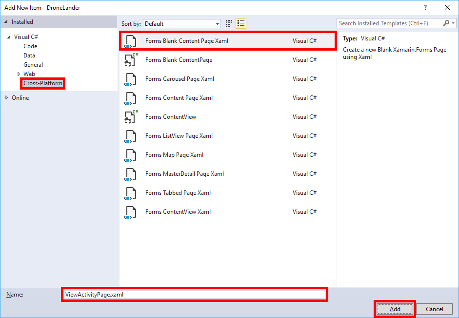
	
	_Adding a new Forms Blank Content Page Xaml page to the project_ 

1. Replace the entire contents of **ViewActivityPage.xaml** with the following code:

	```Xaml
	<?xml version="1.0" encoding="utf-8" ?>
	<ContentPage xmlns="http://xamarin.com/schemas/2014/forms"
	             xmlns:x="http://schemas.microsoft.com/winfx/2009/xaml"
	             BackgroundImage="drone_lander_back.jpg"
	             x:Class="DroneLander.ViewActivityPage">
	    <Grid Margin="40">
	
	        <StackLayout>
	            <Label FontAttributes="Bold" Style="{DynamicResource TitleStyle}" Text="Recent Activity"/>
	            <Label Style="{DynamicResource SubtitleStyle}" Text="The following is a list of your most recent landing attempts:"/>
	            <ListView HasUnevenRows="True" SeparatorVisibility="None" BindingContext="{Binding}" ItemsSource="{Binding CurrentActivity}">
	                <ListView.ItemTemplate>
	                    <DataTemplate>
	                        <ViewCell>
	                            <ViewCell.View>
	                                <StackLayout VerticalOptions="Start" Margin="0,0,0,10" Orientation="Vertical">
	                                    <Label FontAttributes="Bold" Style="{DynamicResource SubtitleStyle}" Text="{Binding Status}" />
	                                    <Label Style="{DynamicResource BodyStyle}" Text="{Binding Description}" />
	                                    <Label Opacity="0.7" Margin="0,-5,0,5" Style="{DynamicResource CaptionStyle}" Text="{Binding ActivityDate, StringFormat='{0:dddd hh:mm tt}'}" />
	                                </StackLayout>
	                            </ViewCell.View>
	                        </ViewCell>
	                    </DataTemplate>
	                </ListView.ItemTemplate>
	            </ListView>
	        </StackLayout>
	
	        <ActivityIndicator Color="#D90000" WidthRequest="100" HeightRequest="100" VerticalOptions="Center" HorizontalOptions="Center" IsRunning="{Binding IsBusy}" IsEnabled="{Binding IsBusy}"/>
	
	    </Grid>
	
	</ContentPage>
	```

1. Open **ViewActivityPage.xaml.cs** and add the following method directly below the ```ViewMainPage``` class initializer:

	```C#
	protected override void OnAppearing()
    {
        base.OnAppearing();

        this.BindingContext = App.ViewModel;

        App.ViewModel.LoadActivityAsync();
    }
	```
	You did it! Now it's time to test your code to make sure you can authenticate against your Azure Mobile App using your Microsoft account, as well as read and write activity data via your mobile backend.

1. Ensure that the Android project is selected as the startup project by right-clicking the **DroneLander.Android** project in Solution Explorer and selecting **Set as StartUp Project**, then click the **Run** button to launch the Android version of Drone Lander in the selected Android emulator.
1. Click **Sign In** in the app toolbar menu, enter your Microsoft account credentials, then click **Sign In** again. If prompted to allow Drone Lander to access your profile and contact list, click **Yes**.

	**NOTE: No profile or contact information will actually be accessed or transmitted at any time during this lab. This dialog is required to be shown when using Microsoft account integration.**

	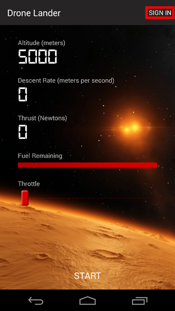

    _Signing in to authenticate a user_

1. After successful sign in, the new Activity toolbar menu item will appear, allowing you to view landing activity:

	

    _The new Activity toolbar menu item_

1. Attempt a landing or two (or three). Remember, landing a drone is hard. Even though you might not be an expert yet, you are likely much better now than you were at the start. Thanks to Azure Mobile Apps and all your hard work, you can now easily view a record of your recent landing activity by clicking **Activity** in the app:

	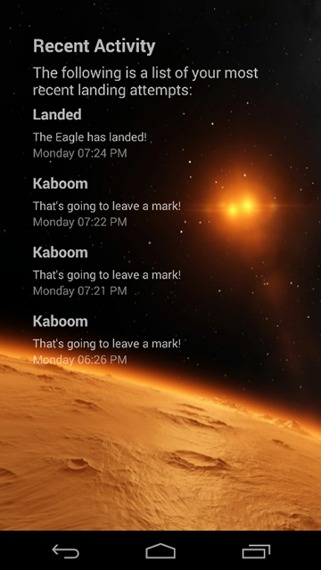

    _Viewing recent landing activity_
 
<a name="Exercise7"></a>
## Exercise 7 (optional): Send telemetry to Mission Control ##

Have some extra time and want to try an additional challenge? As you may recall, your mobile backend is all set to send real time telemetry to Mission Control, including your altitude, fuel levels, and descent rate. **THIS NEEDS MORE INFORMATION**.

1. Open "CoreConstants.cs" in the **DroneLander (Portable)** **Common** folder, and add the following class directly below the ```CoreConstants``` class:

	```C#
	public static class TelemetryConstants
    {
        public const string DisplayName = "";
        public const string Tagline = "";
    }
	```
1. Enter a short value, such as your first or given name, as the value of **DisplayName**. If you were assigned a team name for this session, enter the team name as the value of **DisplayName**. This value will be seen by Mission Control as they track your landing attemptsl
1. To add a bit of flair, feel free to enter a tagline as well, by entering something unique to you as the value of **Tagline**. The value of your tagline **will be seen by other astronauts**, so make sure you come up with something great!  
1. Open **ActivityHelper.cs** in the **DroneLander (Portable)** Helpers folder, and add the following code directly inside the ```ActivityHelper``` class:

	```C#
	public static async void SendTelemetryAsync(string userId, double altitude, double descentRate, double fuelRemaining, double thrust)
    {
        TelemetryItem telemetry = new TelemetryItem()
        {
            Altitude = altitude,
            DescentRate = descentRate,
            Fuel = fuelRemaining,
            Thrust = thrust,
            Tagline = Common.TelemetryConstants.Tagline,
            TeamName = Common.TelemetryConstants.TeamName,
            UserId = userId,
        };

        try
        {
            await TelemetryManager.DefaultManager.CurrentClient.InvokeApiAsync("telemetry", JToken.FromObject(telemetry));
        }
        catch { }
    }
	```
	Notice the use of the build in Azure Mobile SDK ```InvokeApiAsync``` method, and passing a parameter of "telemetry". Calling the InvokeApiAsync method is similar to calling a REST API, however the method assumes the "api/" value and you can simply call the name of the controller. In this case, since the controller is named "TelemetryController", you simply pass the value "telemetry". InvokeApiAsync is also **POST** method by default, so calling it automatically uses the ```Post``` method.


	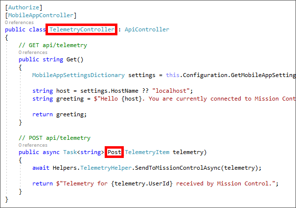

    _The TelemetryController in the DroneLander.Backend project_

1. Open **MainViewModel.cs** in the **DroneLander (Portable)** ViewModels folder, locate the StartLanding method, and replace the entire method with the following code and observe the additional of the new calls to the ```SendTelemetryAsync``` method if a user has been authenticated:

	```C#
	public void StartLanding()
    {
        Helpers.AudioHelper.ToggleEngine();
        
        Device.StartTimer(TimeSpan.FromMilliseconds(Common.CoreConstants.PollingIncrement), () =>
        {
            UpdateFlightParameters();

            if (this.ActiveLandingParameters.Altitude > 0.0)
            {
                Device.BeginInvokeOnMainThread(() =>
                {
                    this.Altitude = this.ActiveLandingParameters.Altitude;
                    this.DescentRate = this.ActiveLandingParameters.Velocity;
                    this.FuelRemaining = this.ActiveLandingParameters.Fuel / 1000;
                    this.Thrust = this.ActiveLandingParameters.Thrust;
                });

                if (this.FuelRemaining == 0.0) Helpers.AudioHelper.KillEngine();

                if (this.IsAuthenticated) Helpers.ActivityHelper.SendTelemetryAsync(this.UserId, this.Altitude, this.DescentRate, this.FuelRemaining, this.Thrust);

                return this.IsActive;
            }
            else
            {
                this.ActiveLandingParameters.Altitude = 0.0;
                this.IsActive = false;

                Device.BeginInvokeOnMainThread(() =>
                {
                    this.Altitude = this.ActiveLandingParameters.Altitude;
                    this.DescentRate = this.ActiveLandingParameters.Velocity;
                    this.FuelRemaining = this.ActiveLandingParameters.Fuel / 1000;
                    this.Thrust = this.ActiveLandingParameters.Thrust;
                });

                LandingResultType landingResult = (this.ActiveLandingParameters.Velocity > -5.0) ? LandingResultType.Landed : LandingResultType.Kaboom;

                if (this.IsAuthenticated)
                {
                    Helpers.ActivityHelper.SendTelemetryAsync(this.UserId, this.Altitude, this.DescentRate, this.FuelRemaining, this.Thrust);
                    Helpers.ActivityHelper.AddActivityAsync(landingResult);
                }
                                    
                MessagingCenter.Send(this.ActivityPage, "ActivityUpdate", landingResult);
                
                return false;
            }
            
        });
    }
	```
1. Once again, ensure that the Android project is selected as the startup project by right-clicking the **DroneLander.Android** project in Solution Explorer and selecting **Set as StartUp Project**, then click the **Run** button to launch the Android version of Drone Lander in the selected Android emulator.
1. Click **Sign In** in the app toolbar menu, enter your Microsoft account credentials.

	>Remember, now that authentication has been added to your mobile backend, only authorized users can add activity and send telemetry.
	
1. Continue to attempt resupply landings and observe the Mission Control remote monitoring screen to view real-time landing attempt information for yourself, as well as your fellow mission pilots.

	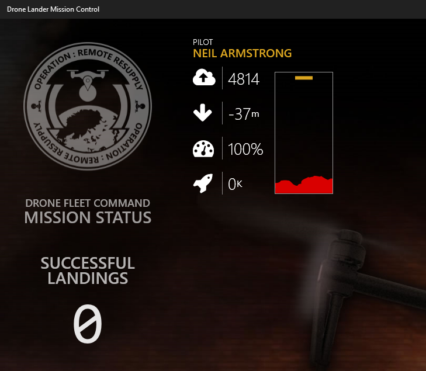

    _Real-time landing telemetry monitored by Mission Control_
 
<a name="Summary"></a>
## Summary ##

The app is now complete, including sending authorized telemetry transmission to Mission Control, back on earth. Your mission, if you choose to accept it, is to continue practicing remote resupply missions for the astronauts that are depending upon you at various remote landing sites on the surface of Mars, while Mission Control monitors your progress.

That's it for Part 4 of Operation Remote Resupply. In Part 5, you will be taking a slight detour to experience and experiment with some powerful supporting tools in Xamarin toolkit, such as the Xamarin Profiler, UI Inspector, and Forms Previewer, as well as how to create interactive, "executable" learning guides and teaching aids with Xamarin Workbooks.