<a name="HOLTitle"></a>
# Operation Remote Resupply, Part 5 #

---

<a name="Overview"></a>
## Overview ##

One of the benefits of working with Xamarin Forms is rich tooling support. Visual Studio 2017 enables developers to build Xamarin Forms apps for iOS, Android, and Windows, and test those apps on real hardware as well as in emulators. It also includes the [Xamarin Forms Previewer](https://developer.xamarin.com/guides/xamarin-forms/xaml/xaml-previewer/) for previewing XAML UIs, and the [Xamarin Profiler](https://developer.xamarin.com/guides/cross-platform/profiler/) for profiling performance and memory use. 

Additional tooling is available outside of Visual Studio. In particular, [Xamarin Workbooks](https://developer.xamarin.com/guides/cross-platform/workbooks/) enable developers to create rich, interactive workbooks that include a mix of documentation and executable code and that optionally send output to *agents* hosted in Windows consoles, WPF, or mobile emulators. Xamarin Workbooks are similar to the [Jupyter notebooks](http://jupyter.org/) that are widely used in academia and are ideal for building tutorials, presentations, and other interactive teaching materials.

In this lab, you will use Xamarin Workbooks to create an interactive document that describes how to convert earth time to Mars time and that includes C# code to perform the conversion. You will also get first-hand experience using the Xamarin Previewer to preview XAML UIs and the Xamarin Profiler to analyze Xamarin Forms apps for potential trouble spots.

<a name="Objectives"></a>
### Objectives ###

In this lab, you will learn how to:

- Build interactive presentations in Xamarin Workbooks
- Use the Xamarin UI Inspector to examine and modify UIs created in Xamarin Workbooks
- Use the Xamarin Forms Previewer to preview Xamarin Forms UIs in Visual Studio
- Use the Xamarin Profiler to analyze performance and memory consumption in Xamarin Forms apps

<a name="Prerequisites"></a>
### Prerequisites ###

The following are required to complete this lab:

- [Visual Studio Community 2017](https://www.visualstudio.com/vs/) or higher
- A computer running Windows 10 that supports hardware emulation using Hyper-V. For more information, and for a list of requirements, see https://msdn.microsoft.com/en-us/library/mt228280.aspx. 
- [Xamarin Workbooks](https://developer.xamarin.com/guides/cross-platform/workbooks/install/) for Windows
- [Xamarin Profiler](https://developer.xamarin.com/guides/cross-platform/profiler/#Download_and_Install) for Windows

If you wish to build and run the iOS version of the app, you also have to have a Mac running OS X 10.11 or higher, and both the Mac and the PC running Visual Studio 2017 require further configuration. For details, see https://developer.xamarin.com/guides/ios/getting_started/installation/windows/.

---

<a name="Exercises"></a>
## Exercises ##

This lab includes the following exercises:

- [Exercise 1: Create a Xamarin Workbook for Android](#Exercise1)
- [Exercise 2: Build an interactive workbook](#Exercise2)
- [Exercise 3: Build a UI for the workbook and use the Xamarin UI Inspector](#Exercise3)
- [Exercise 4: Use the Xamarin Forms Previewer to preview XAML UIs](#Exercise4)
- [Exercise 5: Analyze memory use with the Xamarin Profiler](#Exercise5)
  
Estimated time to complete this lab: **45** minutes.

<a name="Exercise1"></a>
## Exercise 1: Create a Xamarin Workbook for Android ##

Xamarin Workbooks are interactive documents created with the [Xamarin Workbooks](https://developer.xamarin.com/guides/cross-platform/workbooks/install/) app. Versions are available for the Mac and for Windows. Workbooks can be saved as .workbook files and shared with other developers. If you haven't already downloaded and installed Xamarin Workbooks, please do so now. In this exercise, you will create a Xamarin Workbook targeting Android devices and learn the basics of working with cells. 

1. Launch Xamarin Workbooks, select **Android** as the framework, and click **Create**. 
    
	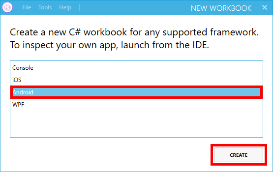

    _Creating a workbook for Android_

1. After a short delay, a blank Xamarin Workbook will be created, and Xamarin Workbooks will launch the default Android emulator. Wait for the emulator to appear and display a blank page like the one shown below.
 
	

    _A blank Xamarin Workbook in the Android emulator_

1. A Xamarin Workbook is composed of *cells*. There are two types of cells: executable cells and documentation cells. Executable cells contain C# code that can be executed inside the workbook. Documentation cells contain text that can be richly formatted. You build interactive workbooks by creating sequences of executable cells and documentation cells.

	Return to Xamarin Workbooks and type the following line of code into the executable cell at the top of the workbook. Then press **Shift+Enter** to insert a blank line:

	```C#
	// This is an executable cell
	```

1. Enter the following line of code on the second line:

	```C#
	DateTime.Now;
	```

1. Click the **Run** button (or press **Ctrl+Enter**) to execute the code. 

	

    _Running an executable cell_

1. Confirm that the result appears underneath the code. Use the drop-down under the **Default** button to try formatting the result in various ways.

	

    _Results of executing a cell_

1. The three buttons in the lower-right corner of each cell allow you to add an executable cell, add a documentation cell, and delete the current cell, in that order. Click the third button in the cell that was added when you executed the code in the previous cell to delete it, and confirm the deletion when prompted to do so.

	

    _Deleting the newly added cell_

1. Click the middle button in the remaining cell to add a documentation cell.

	

    _Adding a documentation cell_

1. Type "This is a documentation cell" into the documentation cell. Then highlight "documentation cell" and click the **Italics** button that appears above it.

	

    _Italicizing text in a documentation cell_

1. Confirm that "documentation cell" is italicized. Then delete the documentation cell.

	

    _Adding a documentation cell_

Now that you're familiar with basic workbook concepts, including adding, deleting, and executing cells, let's build something that's relevant to Operation Remote Resupply.

<a name="Exercise2"></a>
## Exercise 2: Build an interactive workbook ##

In this exercise, you will create a Xamarin Workbook that describes how to convert Earth time to Mars time, and that includes code to perform the conversion.

1. Add a documentation cell to the workbook and enter the following text:

	```
	What time is it on Mars?
	```

1. Format the text in the cell by selecting **Format** > **Heading** > **Level 1** from the overhead menu, and confirm that it takes on the format shown below.

	

    _The workbook heading_
 
1. Add another documentation cell to the workbook. Then paste the following text into the cell to serve as an introduction: 

	```
	Have you ever asked yourself what time it is on Mars? It's not an abstract question when you have settlers on Mars and need to communicate with them. Earth time can be converted to Mars time in a few simple steps.  
	```

1. Add a documentation cell to the workbook and insert the text below. Then highlight "Milliseconds Since January 1, 1970" and use the **Format** > **Heading** > **Level 2** command to format the text as a subheading.

	```
	Milliseconds Since January 1, 1970

	The first step is to compute the number of milliseconds that have elapsed since January 1, 1970, in Universal Time:
	```

1. Insert a new executable cell and enter the following code:

	```C#
	DateTime value = DateTime.UtcNow;
	DateTime earthEpochDate = new System.DateTime(1970, 1, 1);
	double elapsedMilliseconds = (value - earthEpochDate).TotalMilliseconds;
	```

1. Click the **Run** button or press **Ctrl+Enter** to execute the code and display the number of milliseconds elapsed since January 1, 1970: 

	

    _Computing the number of milliseconds elapsed since January 1, 1970_
 
1. Delete the executable cell that was added when you ran the code. Then add a documentation cell, insert the following text, and format the first line as a level-2 subheading:

	```
	Julian Date (Universal Time)

	The next step is to convert milliseconds into days and add the number of days between noon on January 1, 4713 B.C. and midnight on January 1, 1970 (2,440,587.5 days) to yield a Julian date: 
	```

1. Insert a new executable cell and enter the statement below. Then run it to compute a Julian date.

	```C#
	double epochJulianDate = 2440587.5 + (elapsedMilliseconds / (8.64 * Math.Pow(10, 7)));
	```

	

    _Computing a Julian date_

1. Delete the executable cell that was added when you ran the code, and add a new documentation cell. Insert the following text, and then format the first line as a level-2 subheading:

	```
	Julian Date (Terrestrial Time)

	Now convert the Julian date in Universal Time to a Julian date in Terrestrial Time by adding the number of leap seconds since January 1, 2017:
	```

1. Insert a new executable cell and enter the statement below. The run it to convert the Julian date to Terrestrial Time:

	```C#
	double terrestrialJulianDate = epochJulianDate + (37 + 32.184) / 86400;
	```

	

    _Converting Universal Time to Terrestrial Time_

1. Delete the executable cell that was added when you ran the code, and add a new documentation cell. Insert the following text, and then format the first line as a level-2 subheading:

	```
	Julian Date Relative to January 1, 2000

	Subtract the number of days between January 1, 1970 and January 1, 2000 to convert the terrestrial Julian date computed in the previous step into one that is relative to January 1, 2000:
	```

1. Insert a new executable cell and enter the statement below. Then run it to convert the Julian date into one that is relative to January 1, 2000:

	```C#
	double martianEpochDifference = terrestrialJulianDate - 2451545.0;
	```

	

    _Rebasing the Julian date_

1. Delete the executable cell that was added when you ran the code, and add a new documentation cell. Insert the following text, and then format the first line as a level-2 subheading:

	```
	Mars Sol Date

	The equivalent of the Julian date for Mars is the Mars sol date. At midnight on January 6, 2000 on earth, it was midnight at the Martian prime meridian, so our starting point for Mars sol date is ΔJ2000 - 4.5. The length of a Martian day and Earth day differ by a ratio of 1.027491252, so we divide by that. By convention, to keep the Martial sol date positive going back to midday on December 29, 1873, we add 44,796. A slight adjustment of 0.00096 is required since the midnights aren't perfectly aligned:
	```

1. Insert a new executable cell and enter the statement below. Then run it to display the Martian sol date:

	```C#
	double martianSolDate = (((martianEpochDifference - 4.5) / 1.027491252) + 44796.0 - 0.00096);
	```

	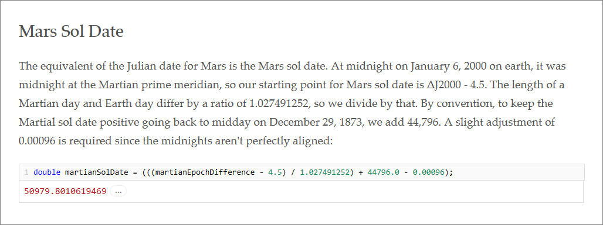

    _Computing the Martial sol date_

1. Delete the executable cell that was added when you ran the code, and add a new documentation cell. Insert the following text, and then format the first line as a level-2 subheading:

	```
	Mars Coordinated Time

	Mars Coordinated Time (MTC) is like UTC, but for Mars. Because it is just a mean time, you can  calculate it based on the Mars Sol Date like this:
	```

1. Insert a new executable cell and enter the following statement. Then run it to display the current time in Mars Coordinated Time (MTC):

	```C#
	var mct = System.TimeSpan.FromHours((martianSolDate % 1) * 24);
	mct.ToString("hh\\:mm\\:ss");
	```

	

    _Computing Mars Coordinated Time_
 
1. One of the cool things about Xamarin Workbooks is that you can do almost anything you would normally do in C#, including adding methods and extension methods. To demonstrate, add the following statements to the executable cell that was added when you ran the last one:

	```C#
	static double ToMartianSolDate(this DateTime value)
	{
	    DateTime earthEpochDate = new System.DateTime(1970, 1, 1);
	    double elapsedMilliseconds = (value - earthEpochDate).TotalMilliseconds;
	    double epochJulianDate = 2440587.5 + (elapsedMilliseconds / (8.64 * Math.Pow(10, 7)));
	    double terrestrialJulianDate = epochJulianDate + (37 + 32.184) / 86400;
	    double martianEpochDifference = terrestrialJulianDate - 2451545.0;
	    double martianSolDate = (((martianEpochDifference - 4.5) / 1.027491252) + 44796.0 - 0.00096);
	    return martianSolDate;
	}
	
	static TimeSpan ToMartianTime(this DateTime value)
	{   
	    return System.TimeSpan.FromHours((value.ToMartianSolDate() % 1) * 24);
	}
	```

	These extension methods will come in handy when you add code to interact with the Android emulator in the next exercise.

Xamarin Workbooks like this one are great for creating interactive documents to teach concepts and let users try out code implementing those concepts. Currently, however, the Android enulator still shows a blank page. Let's modify the workbook to use the emulator to show the current earth time and Mars time. 

<a name="Exercise3"></a>
## Exercise 3: Build a UI for the workbook and use the Xamarin UI Inspector ##

As you build a workbook, you can write code that creates a user interface from Xamarin Forms controls and displays them in the agent that was started with the workbook — in this case, the app running in the Android emulator. Furthermore, you can use Xamarin Workbooks' integrated UI Inspector to examine the controls that you created and adjust control properties to fine-tune the UI.

In this exercise, you will enhance the workbook you built in Exercise 2 to show the current earth time and Mars time in the Android emulator, and learn how to use the Xamarin UI Inspector to inspect and modify control properties.

1. Add an executable cell to the workbook. Then select **File** > **Add Package...** from the overhead menu and type "Xamarin.Forms" into the search box. Select the latest **Xamarin.Forms** package, and then click **Add Package** to add the package to the workbook.

	> One of the most powerful features of Xamarin Workbooks is that you can import NuGet packages just like you can in Visual Studio. Once a package is imported, C# code that you add to the workbook can use the types in that package.

	

    _Adding Xamarin.Forms to a workbook_
 
1. Confirm that three ```#r``` statements appear referencing the assemblies imported from the package.

	

    _Statements referencing Xamarin Forms assemblies_
 
1. In the new executable cell that appears in the workbook, insert the following ```using``` statement and then run it:
 
	```C#
	using Xamarin.Forms;
	```

1. Delete the executable cell that was added when you ran the code. Add a new documentation cell and insert the following text: 

	```
	Add controls to display the current time on earth and on Mars:
	```

1. Insert a new executable cell and enter the following statements:
 
	```C#
	var page = Xamarin.Forms.Application.Current.MainPage as ContentPage;
	var layout = new StackLayout() { Margin = new Thickness(40) };
	var earthlabel = new Label() { Text = "Earth Time:", FontSize = 32 };
	var earthTimeLabel = new Label() { Text = DateTime.Now.ToString("hh:mm:ss tt"), FontSize = 32 };
	
	layout.Children.Add(earthlabel);
	layout.Children.Add(earthTimeLabel);
	
	var marslabel = new Label() { Text = "Martian Time:", FontSize = 32 };
	var marsTimeLabel = new Label() { Text = earthEpochDate.Add(mct).ToString("hh:mm:ss tt"), FontSize = 32 };
	
	layout.Children.Add(marslabel);
	layout.Children.Add(marsTimeLabel);
	
	page.Content = layout;
	```

1. Run the code and confirm that the following page appears in the Android emulator:

	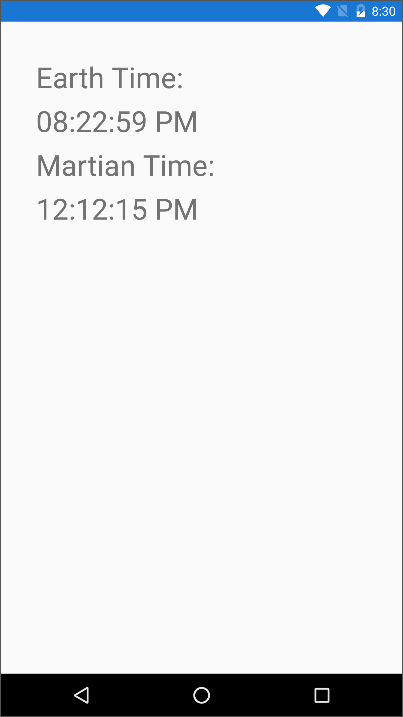

    _Android emulator showing earth time and Mars time_
 
1. Now let's use a software timer to update the times shown on the page once a second. Begin by deleting the executable cell that was added when you ran the last cell and adding a documentation cell. Insert the following text into the documentation cell: 	
	
	```
	Use a timer to refresh the display once per second:
	```

1. Insert a new executable cell and enter the following code to start a device timer and update the app's UI every second:

	```C#
	Device.StartTimer(TimeSpan.FromSeconds(1), () =>
	{
	    // LOCAL EARTH TIME
	    earthTimeLabel.Text = DateTime.Now.ToString("hh:mm:ss tt");
	
	    // EARTH UTC TO MARTIAN TIME
	    marsTimeLabel.Text = earthEpochDate.Add(DateTime.UtcNow.ToMartianTime()).ToString("hh:mm:ss tt");
	    return true;
	});
	```

1. Run the cell and confirm that the times shown in the emulator update in real time.

1. The Xamarin Workbooks app includes a UI Inspector that lets you inspect values in the UI and adjust them without making permanent changes to your code. To open the inspector, click **View Inspector** in the lower-left corner of the Xamarin Workbooks window.

	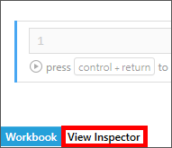

    _Opening the Xamarin UI Inspector_
 
1. Select **Xamarin.Forms** from the drop-down list to view the Xamarin Forms control tree. 

	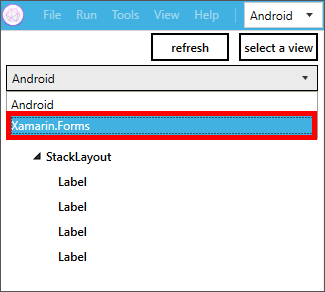

    _Viewing the Xamarin Forms controls_
 
1. In the UI Inspector, click the first ```Label``` control to select that control. As an alternative, you can click the **select a view** button and then click "Earth Time" in the Android emulator. 

	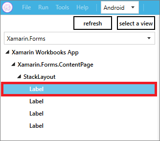

    _Selecting the "Earth Time" Label control_

1. Locate the ```TextColor``` property in the properties panel on the right and change the **R** value to 217 and the **A** (alpha transparency) property to 100%.

	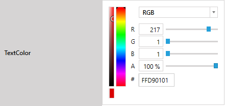

    _Changing the Label control's foreground color_ 

1. Return to the Android emulator and confirm that "Earth Time" changed to red.

	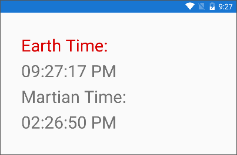

    _Modified Label control in the emulator_ 

1. Repeat this process for the remaining three ```Label``` controls to change their text color to red.

1. Select the ```ContentPage``` control.

	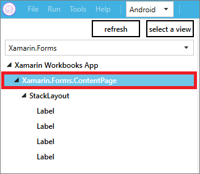

    _Selecting the ContentPage_

1. Find the ```BackgroundColor``` property in the properties panel and set the **R**, **G**, and **B** values to 0 and the **A** value to 100% to change the background color to black.

1. Return to the Android emulator and confirm that it now displays red text against a black background.

	

    _The updated UI using the inspector_ 

1. Click the **refresh** button in the UI Inspector to update the preview shown there. If you would like, use your mouse to change the orientation of the preview.	

	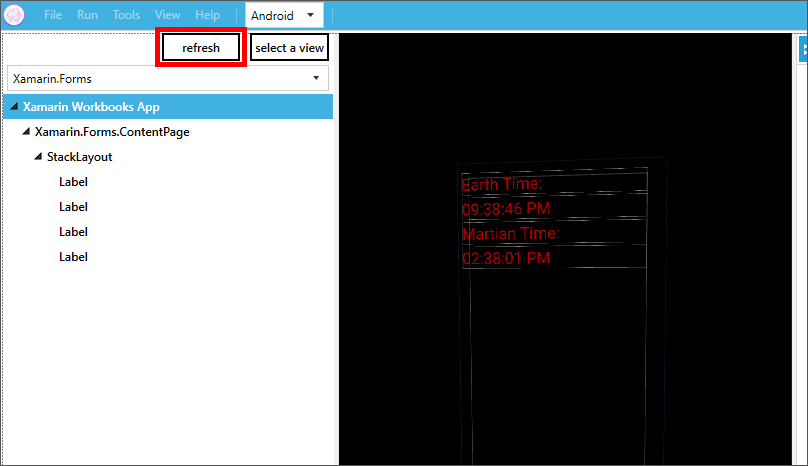

    _Refreshing the UI preview_ 

The UI Inspector is great for examining the controls that form an app's UI and tweaking those controls as needed. Not all UI properties can be manipulated directly from the inspector, but most of them can.

<a name="Exercise4"></a>
## Exercise 4: Use the Xamarin Forms Previewer to preview XAML UIs ##

When you create XAML UIs in Visual Studio by typing text and angle brackets, you don't know precisely how the UI will look until you run the app. Tweaking a UI often means repeatedly making changes to the XAML and rerunning the app to gauge the effect of those changes. But there is a better way. In this exercise, you will use Visual Studio 2017's integrated Xamarin Forms Previewer to see a live preview of the XAML that you enter. You will also learn how to use the previewer to see how the app will look on screens of various sizes.  

1. Open the DroneLander solution in Visual Studio 2017. Then open **MainPage.xaml** in the **DroneLander (Portable)** project.

	

    _MainPage.xaml in the XAML editor_ 

1. Use Visual Studio's **View** > **Other Windows** > **Xamarin.Forms Previewer** command to open the Xamarin Forms Previewer. Then use the **Window** > **New Vertical Tab Group** command to position the preview window next to the XAML editor.

	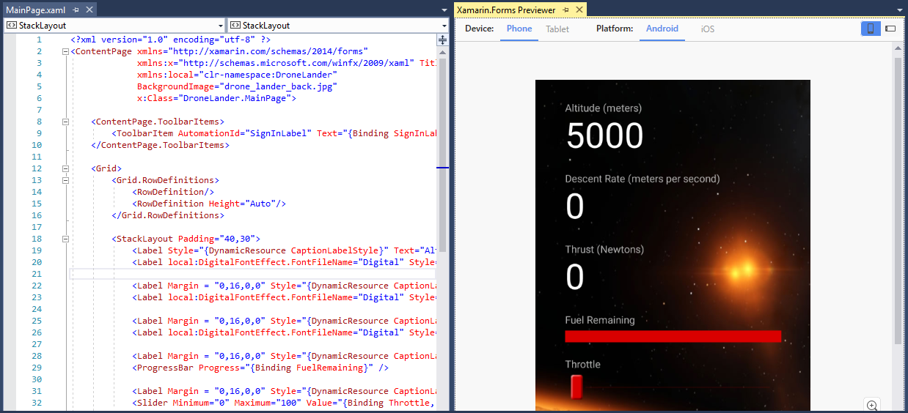

    _Previewing XAML in the Xamarin Forms Previewer_ 

	Observe that the preview window shows not only the XAML elements declared in **MainPage.xaml**, but also changes made at run-time by custom renderers. Most controls render perfectly in the Xamarin Forms Previewer, but be aware that some platform-specific elements such as the custom effect used to change the font on Android will not be seen until run-time.

1. As an experiment, change the case of the "Altitude" and "Descent Rate" labels in the XAML editor, and check out the corresponding changes in the Xamarin Forms Previewer.

	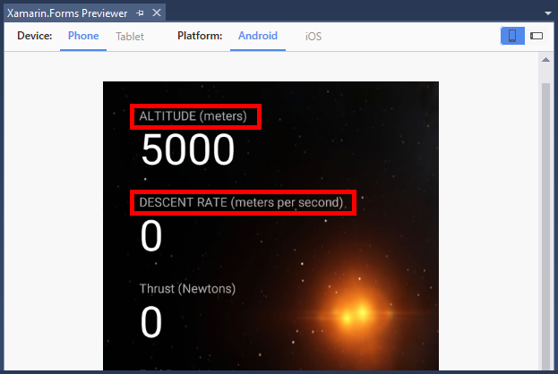

    _Changes displayed in the Xamarin Forms Previewer_ 

1. The Xamarin Forms Previewer also allows you to preview the UI in different form factors and orientations. To demonstrate, click **Tablet** in the preview window, and then click the **landscape mode icon** in the upper-right corner of the window to preview **MainPage.xaml** in landscape mode on a tablet.

	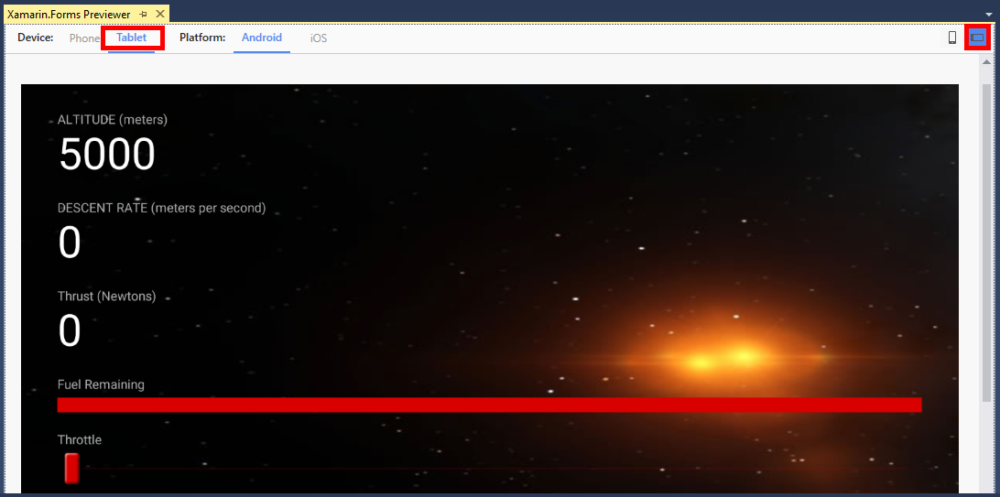

    _Previewing the UI on a tablet in landscape mode_ 

1. Finish up by undoing the case changes made to the labels in Step 3.

The Xamarin Forms Previewer streamlines the development process by allowing you to see UI changes as you make them, and to do so without launching the app over and over again. But there's another tool you should be familiar with if you're doing Xamarin Forms development: the Xamarin Profiler.

<a name="Exercise5"></a>
## Exercise 5: Analyze memory use with the Xamarin Profiler ##

Performance is crucial to any app. If an app performs sluggishly, users are liable to abandon it in favor of competing apps. In addition, memory leaks are a common cause of poor performance and even crashes and must be avoided at all costs. The Xamarin Profiler included in Visual Studio Enterprise 2017 provides tools for measuring performance, identifying performance bottlenecks, finding memory leaks, and generally identifying potential trouble spots. In this exercise, you will use the Xamarin Profiler to analyze memory usage in Drone Lander.

> This exercise requires Visual Studio Enterprise 2017. If you are using the Community or Professional edition of Visual Studio 2017, simply read through this exercise to learn about the some of the profiler's features and capabilities.

1. Use the **Tools** > **Xamarin Profiler** command in Visual Studio to start the Xamarin Profiler.

1. Select **Performance** as the "target" and click **Choose** to run the app and start a profiling session.

	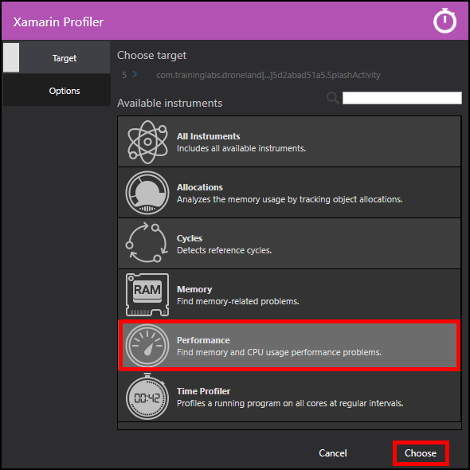

    _Starting a profiling session_ 

1. In the Xamarin Profiler window, change the "Group by" filter to **Assembly** to see which assemblies consume the most memory.

	

    _Viewing top memory allocations by assembly_ 

1. Switch to the Android emulator and start a landing attempt. Then immediately switch back to the Xamarin Profiler and observe how the memory allocations change over time. In particular, notice the gradual increase in memory consumption for Xamarin.Forms.Core.dll. 

	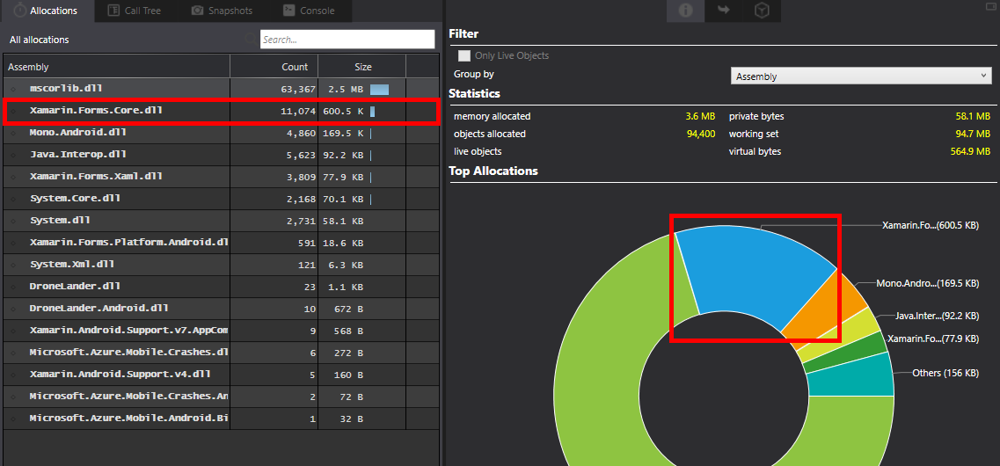

    _Monitoring memory allocations in real time_ 

	Although a gradual memory increase in a specific assembly may not pose an immediate problem, over time these resources will need to be disposed of or resource constraints could lead to unexpected behavior or even crashes. The increase in memory use by Xamarin.Forms.Core.dll indicates that this portion of the app might need to be scrutinized more carefully.

1. Experiment with other profile instruments. For example, click **Call Tree** and then expand individual items to get a more granular view of resource allocations.

	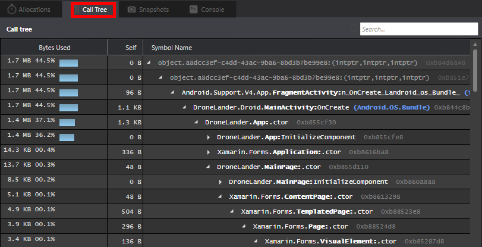

    _Monitoring memory alocations for individual resources_ 

1. Click the **Stop Profiling** button in the Xamarin Profiler toolbar to end the profiling session.

	

    _Ending a profiling session_ 

There is much more that you can do with the Xamarin Profiler, but this is a start. Other helpful features include the Time Profiler, which measures the execution times for individual method calls, and Cycles, which tracks references to objects that are not properly disposed of.

<a name="Summary"></a>
## Summary ##

Xamarin Workbooks, the Xamarin Forms Previewer, and the Xamarin Profiler are powerful tools in the hands of developers building Xamarin Forms apps. In the next and final lab, you will supplement what you have learned so far by learning about some of the options for testing Xamarin Forms apps — specifically, Xamarin UI Tests and the Xamarin Test Cloud.