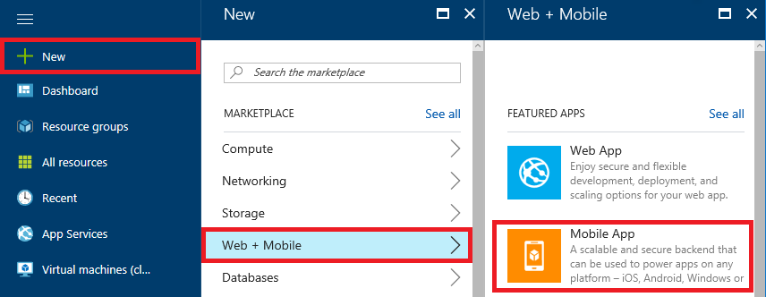
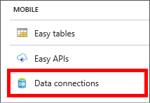
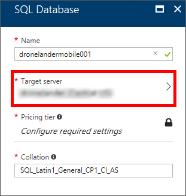
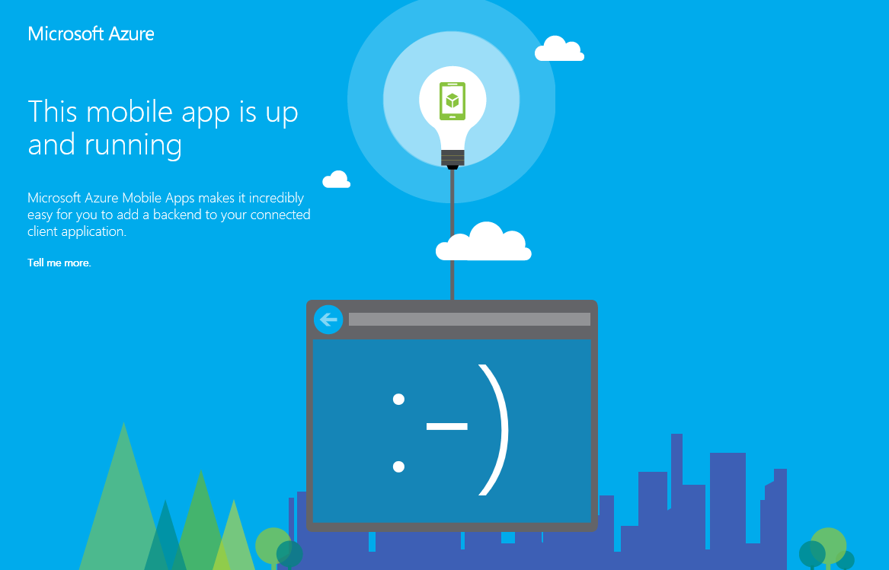
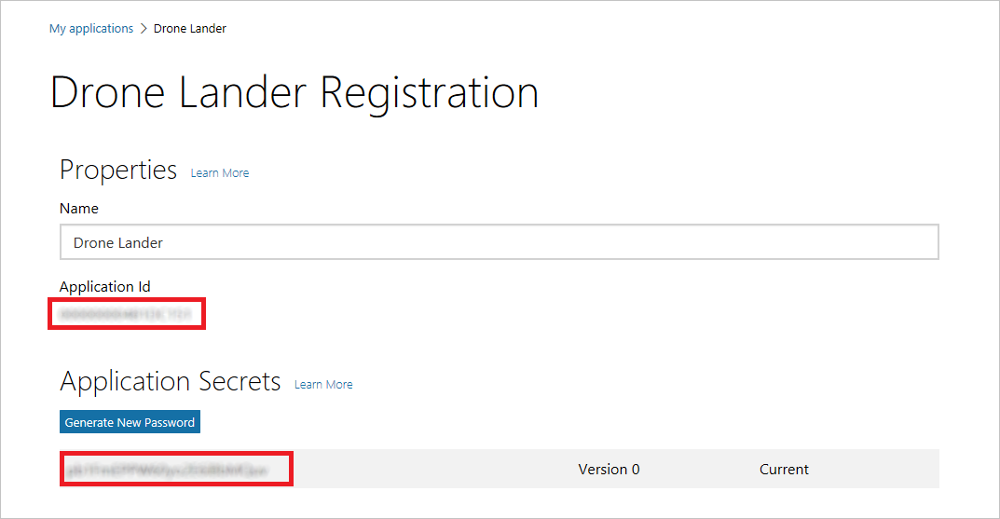
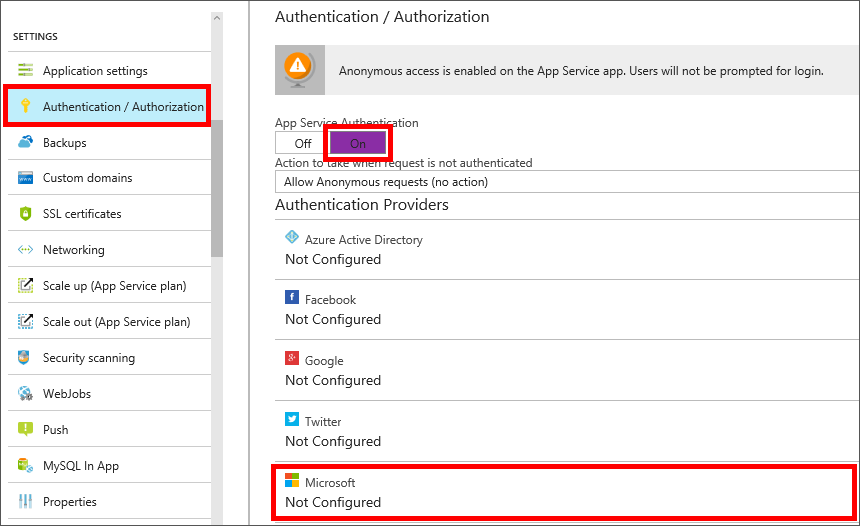
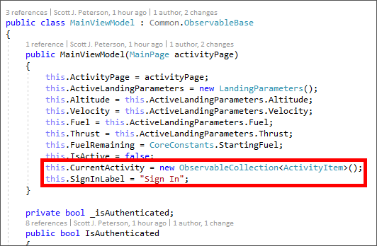
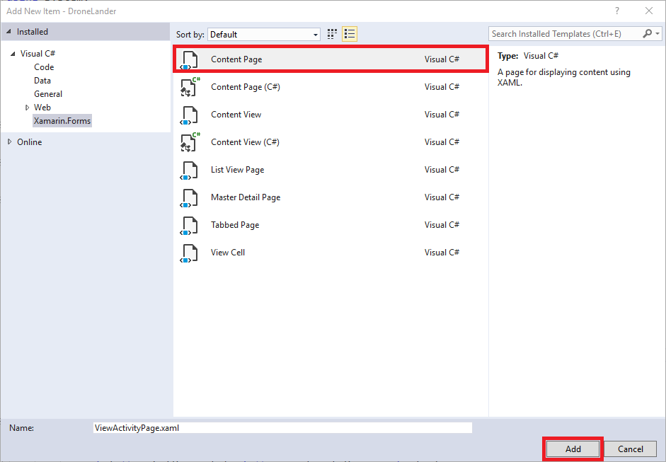

<a name="HOLTitle"></a>
# Operation Remote Resupply, Part 5 #

---

<a name="Overview"></a>
## Overview ##

At present, Drone Lander app is a stand-alone app that doesn't connect to the cloud. In the real world, mobile apps frequently use cloud services to store data, authenticate users, enact push notifications, and more. Building cloud services for mobile apps frequently adds significant time and cost to the development process, and requires additional skills beyond those required to build client apps.  

[Azure Mobile Apps](https://azure.microsoft.com/en-us/services/app-service/mobile/) is an Azure service that simplifies the process of building back-end services for mobile apps. It supports authentication, push notifications, offline data syncing, and more. It also supports [Easy Tables](https://blog.xamarin.com/getting-started-azure-mobile-apps-easy-tables/), which make it easy to store data in the cloud, and Easy APIs, which make it extraordinarily easy to implement REST endpoints for client apps to call. In short, Azure Mobile Apps offer a comprehensive, scalable, and easily manageable platform for creating the kinds of back-end services that client apps often require.

In Part 5 of Operation Remote Resupply, you will provision an Azure Mobile App in the Azure Portal and connect it to a database. Then you will use Visual Studio 2017 to implement a back-end service for the Drone Lander app and modify the app so that it uses the service to store information regarding landing attempts in the cloud and transmit real-time telemetry as you descend to the Mars surface. That telemetry will be fed to a Mission Control app shown on the big screen at the front of the room so everyone can see the supply missions that are flown. Then you will compete to be the first to land — and hopefully not the last!

<a name="Objectives"></a>
### Objectives ###

In this lab, you will learn how to:

- Create an Azure Mobile App
- Write a back-end service that stores data in the cloud
- Write a back-end service that exposes REST APIs
- Deploy a back-end service to an Azure Mobile app
- Authenticate users using an Azure Mobile App
- Call back-end services from a client app

<a name="Prerequisites"></a>
### Prerequisites ###

The following are required to complete this lab:

- [Visual Studio Community 2017](https://www.visualstudio.com/vs/) or higher
- A computer running Windows 10 that supports hardware emulation using Hyper-V. For more information, and for a list of requirements, see https://msdn.microsoft.com/en-us/library/mt228280.aspx. 
- An Microsoft Azure subscription. If you don't have one, [sign up for a free trial](http://aka.ms/WATK-FreeTrial)

---

<a name="Exercises"></a>
## Exercises ##

This lab includes the following exercises:

- [Exercise 1: Create an Azure Mobile App](#Exercise1)
- [Exercise 2: Add a data connection](#Exercise2)
- [Exercise 3: Implement and deploy a back-end service](#Exercise3)
- [Exercise 4: Configure the service to support authentication](#Exercise4)
- [Exercise 5: Add authentication logic to Drone Lander](#Exercise5)
- [Exercise 6: Update Drone Lander to authenticate users and record landings](#Exercise6)
- [Exercise 7: Update Drone Lander to send telemetry to Mission Control](#Exercise7)
 
Estimated time to complete this lab: **45** minutes.

<a name="Exercise1"></a>
## Exercise 1: Create an Azure Mobile App ##

The first step in using Azure Mobile Apps to build a back end for a Xamarin Forms app — or any client app, for that matter — is to create an Azure Mobile App. In this exercise, you will use the Azure portal to create an Azure Mobile App for Drone Lander. Under the hood, an Azure Mobile App is simply an [Azure App Service](https://azure.microsoft.com/services/app-service/) that is capable of hosting Web sites and Web services. Later, you will build a service and deploy it to the Mobile App.

1. Open the [Azure Portal](https://portal.azure.com) in your browser. If asked to sign in, do so using your Microsoft account.

1. Click **+ New**, followed by **Web + Mobile** and **Mobile App**.

	

    _Creating a new Azure Mobile App_

1. Enter an app name that is unique within Azure, such as "dronelandermobile001." Under **Resource Group**, select **Create new** and enter "DroneLanderResourceGroup" as the resource-group name to create a resource group for the Mobile App. Accept the default values for all other parameters, and then click **Create**.
    
	

    _Creating an Azure Mobile App_

1. Click **Resource groups** in the ribbon on the left side of the portal, and then click **DroneLanderResourceGroup** to open the resource group.

	

    _Opening the resource group_

1. Click the **Refresh** button in the resource-group blade periodically until "Deploying" changes to "Succeeded," indicating that the Mobile App has been deployed.
 
Once the Azure Mobile App is deployed, you're ready for the next step: creating a database in Azure and connecting the Azure Mobile App to it.

<a name="Exercise2"></a>
## Exercise 2: Add a data connection ##

Every front end needs a great back end, and back ends frequently store data and provide APIs for accessing that data. Azure Mobile Apps support the concept of "Easy" tables and APIs, as well as direct data connections that store data in either SQL databases or Azure blob storage. In this exercise, you will configure the Azure Mobile App you created in Exercise 1 to store data in an Azure SQL Database. *This is the database in which information about landing attempts will be recorded*.

1. In the blade for the "DroneLanderResourceGroup" resource group, click the Azure Mobile App that you deployed in Exercise 1. (It will be listed as an "App Service," which is the family of services to which Azure Mobile Apps belong.) Then scroll down in the menu on the left side of the blade and click **Data connections**.

	

    _Viewing data connections_
 
1. Click **+ Add** to add a new data connection.
 
1. Ensure **SQL Database** is selected. Then click **Configure required settings**, followed by **Create a new database**.

	

    _Creating a new database_
 
1. Enter the name of your Azure Mobile App as the database name, and then click **Target server**.

	> Using the same name for your Mobile App and SQL database is NOT a requirement. It is simply a convenience for working this lab.

	

    _Naming a database_
 
1. Click **Create a new server** and enter "dronelandermobile001" as the server name. Enter a user name and password of your choosing for accessing the server, and then click **Select**.

1. Click the **Select** button at the bottom of the "SQL Database" blade. Then click **Connection string** in the "Add data connection" blade, **OK** at the bottom of the "Connection String" blade, and **OK** at the bottom of the "Add data connection" blade.

	> Since you will use a "quickstart" project in the next exercise to implement a back-end service, it's important that you accept the default connection string name of "MS_TableConnectionString." You could change the connection-string name, but you would have to change it in the quickstart code as well.

	

    _Adding a data connection_
 
Provisioning the database and database server will take a few minutes, but there's no need to wait. You can move on to the next exercise and begin writing the back-end service that you will deploy to the Azure Mobile App.

<a name="Exercise3"></a>
## Exercise 3: Implement and deploy a back-end service ##

In this exercise, you will use Visual Studio to write a service and deploy it to the Azure Mobile App. The service will include two MVC controllers: one that exposes REST-callable methods for writing information about landing attempts to the database you created in the previous step (and for retrieving that information once written), and one that exposes REST-callable methods for transmitting telemetry data — altitude, descent rate, fuel remaining, thrust, and so on — to Mission Control, where it can be displayed for all to see on the big screen at the front of the room.

1. In Visual Studio 2017, open the **DroneLander** solution that you built in previous labs.

1. Right-click the **DroneLander** solution and use the **Add** > **Existing Project...** command to add **DroneLander.Backend.csproj** from the lab's "Resources\Quick Start\DroneLander.Backend" folder. This is a quick-start project for creating a back-end service for Azure Mobile Apps.

	> You can click **Quickstart** in the blade for an Azure Mobile App in the Azure Portal and download quick-start projects of various types. Because these projects contain infrastructure you don't need and would have to be modified anyway, you are importing a project that has been specifically prepared for this lab.
 
1. Add a folder named "Controllers" to the **DroneLander.Backend** project. Right-click the "Controllers" folder and use the **Add** > **Class** command to add a class file named **ActivityItemController.cs**. Then replace the contents of the file with the following code:

	```C#
	using System.Linq;
	using System.Threading.Tasks;
	using System.Web.Http;
	using System.Web.Http.Controllers;
	using System.Web.Http.OData;
	using Microsoft.Azure.Mobile.Server;
	using DroneLander.Service.Models;
	using DroneLander.Service.DataObjects;
	
	namespace DroneLander.Service.Controllers
	{
	    public class ActivityItemController : TableController<ActivityItem>
	    {
	        protected override void Initialize(HttpControllerContext controllerContext)
	        {
	            base.Initialize(controllerContext);
	            DroneLanderServiceContext context = new DroneLanderServiceContext();
	            DomainManager = new EntityDomainManager<ActivityItem>(context, Request);
	        }
	
	        // GET tables/ActivityItem
	        public IQueryable<ActivityItem> GetAllActivityItems()
	        {
	            return Query();
	        }
	
	        // GET tables/ActivityItem/48D68C86-6EA6-4C25-AA33-223FC9A27959
	        public SingleResult<ActivityItem> GetActivityItem(string id)
	        {
	            return Lookup(id);
	        }
	
	        // PATCH tables/ActivityItem/48D68C86-6EA6-4C25-AA33-223FC9A27959
	        public Task<ActivityItem> PatchActivityItem(string id, Delta<ActivityItem> patch)
	        {
	            return UpdateAsync(id, patch);
	        }
	
	        // POST tables/ActivityItem
	        public async Task<IHttpActionResult> PostActivityItem(ActivityItem item)
	        {
	            ActivityItem current = await InsertAsync(item);
	            return CreatedAtRoute("Tables", new { id = current.Id }, current);
	        }
	
	        // DELETE tables/ActivityItem/48D68C86-6EA6-4C25-AA33-223FC9A27959
	        public Task DeleteActivityItem(string id)
	        {
	            return DeleteAsync(id);
	        }
	    }
	}
	```

	This controller uses the data connection you created in the previous exercise to access an "ActivityItem" table in the database. ```ActivityItemController``` derives from ```TableController```, which provides a base implementation for controllers in Azure Mobile Apps and makes it easy to perform create, read, update, and delete (CRUD) operations on data stores connected to those apps.

1. Right-click the "Controllers" folder again and use the **Add** > **Class** command to add a class file named **TelemetryController.cs**. Then replace the contents of the file with the following code:

	```C#
	using System.Web.Http;
	using System.Web.Http.Tracing;
	using Microsoft.Azure.Mobile.Server;
	using Microsoft.Azure.Mobile.Server.Config;
	using System.Threading.Tasks;
	using DroneLander.Service.DataObjects;
	
	namespace DroneLander.Service.Controllers
	{    
	    [MobileAppController]
	    public class TelemetryController : ApiController
	    {
	        // GET api/telemetry
	        public string Get()
	        {
	            MobileAppSettingsDictionary settings = this.Configuration.GetMobileAppSettingsProvider().GetMobileAppSettings();
	            
	            string host = settings.HostName ?? "localhost";
	            string greeting = $"Hello {host}. You are currently connected to Mission Control";
	           
	            return greeting;
	        }
	
	        // POST api/telemetry
	        public async Task<string> Post(TelemetryItem telemetry)
	        {
	            await Helpers.TelemetryHelper.SendToMissionControlAsync(telemetry);
	            return $"Telemetry for {telemetry.UserId} received by Mission Control.";
	        }
	    }
	}
	```

	Note the ```[MobileAppController]``` attribute decorating the class definition. This attribute designates an ```ApiController``` as an Azure Mobile App controller, meaning it can be accessed through the Azure Mobile SDK using standard APIs. ```TelemetryController``` is responsible for sending real-time telemetry to Earth-based Mission Control to monitor the progress of landing attempts. 
 
1. To ensure that your transmissions are properly routed to Mission Control, you need to insert a mission event name. Open **CoreConstants.cs** in the "Common" folder of the **DroneLander.Backend** project, locate the field named ```MissionEventName```, and replace "[ENTER_MISSION_EVENT_NAME]" with the value given to you at the start of the event.

	

    _Updating the mission event name_

1. The next step is to publish the service to the cloud. Right-click the **DroneLander.Backend** project and select **Publish...** from the context menu. Then choose **Select Existing** and click **Publish**. 

	

    _Publishing an Azure Mobile App_ 

1. Select the Azure Mobile App you created in Exercise 1. Then click **OK** to begin the publishing process. 
 
1. Wait until your browser opens to the default Azure Mobile App landing page, indicating that the service was successfully deployed.

	

    _The default Azure Mobile App landing page_ 

The mobile back-end is now in place, and it contains methods that double as REST endpoints that can be called from the Drone Lander app to record landing attempts and transmit telemetry data. In a few minutes, you will modify the client app to call these endpoints. But first, let's talk about authentication.

<a name="Exercise4"></a>
## Exercise 4: Configure the service to support authentication ##

Many mobile apps — especially enterprise apps — require users to sign in before accessing features and services. Authentication can be complicated, especially if you wish to use protocols such as [OAuth](https://en.wikipedia.org/wiki/OAuth) and support sign-ins using Microsoft accounts and social-media accounts. Azure Mobile Apps simplify the creation of apps that require authentication by providing built-in support for popular federated-identity providers, including Azure Active Directory, Facebook, Google, Microsoft, and Twitter. In this exercise, you will configure the service you deployed in the previous exercise to support authentication and modify it to ignore calls from unauthenticated users.   
 
1. Navigate to the [Microsoft Application Registration portal](https://apps.dev.microsoft.com/) in your browser and sign in with your Microsoft account.

1. Click **Add an app** at the top of the "Live SDK applications" section.

	

    _Registering an app_ 

1. Enter "Drone Lander" as the app name and click **Create Application**.

1. Scroll down and click the **Add URL** button next to "Redirect URLs." Then enter the following URL, replacing "[YOUR_MOBILE_APP_NAME]" with the name of the Azure Mobile App you created in Exercise 1. 

	```
	https://[YOUR_MOBILE_APP_NAME].azurewebsites.net/.auth/login/microsoftaccount/callback
	```

	

    _Adding a redirect URL_ 

1. Click the **Save** button at the bottom of the page. 

	

    _Saving registration changes_ 

1. Scroll to the top of the page and copy the application ID and the application secret into Notepad or your favorite text editor.

	

    _Copying the application ID and application secret_ 

1. Return to the [Azure Portal](https://portal.azure.com) and to the blade for the Azure Mobile App you created in Exercise 1. Click **Authentication / Authorization** in the menu on the left. Then turn "App Service Authentication" **On** and select **Microsoft** from the list of authentication providers.  

	

    _Selecting the Microsoft authentication provider_ 

1. Paste the application ID into the **Client Id** field and the application secret into the **Client Secret** field in the "Microsoft Account Authentication Settings" blade. Make sure the values you entered do not have any leading or trailing spaces, and then click **OK**.

	

    _Entering client secrets_ 

1. Click **Save** at the top of the blade to save the settings that you just entered.

1. Azure Mobile App authentication can be applied at any level, from an entire service to a single method exposed by that service. You will apply it at the class level by adding special attributes to the controller classes you created in the previous exercise.

	Return to the DroneLander solution in Visual Studio 2017. Open **ActivityItemController.cs** in the **DroneLander.Backend** project's "Controllers" folder and locate the ```ActivityItemController``` class near the top of the file. Then add an ```[Authorize]``` attribute to the class:

	

    _Attributing the controller class_ 

	The presence of this attribute means that calls to any of the controller's methods from unauthenticated users will be rejected. 

1. Open **TelemetryController.cs** and add an ```[Authorize]``` attribute to the ```TelemetryController``` class, directly above the ```[MobileAppController]``` attribute that is already there. Now ```TelemetryContoller``` methods will require authentication, too.

1. Right-click the **DroneLander.Backend** project and use the **Publish...** command to publish your changes to Azure.

With authentication support in place on the back end, the next step is to update your Xamarin Forms solution to leverage that support.

<a name="Exercise5"></a>
## Exercise 5: Add authentication logic to Drone Lander ##

The [Azure Mobile Client SDK](https://www.nuget.org/packages/Microsoft.Azure.Mobile.Client/) simplifies the process of adding authentication support to Xamarin Forms apps. When paired with an Azure Mobile App on the server, a single call is sufficient to sign a user in using an SDK-provided login page that is customized for individual identity providers, or to sign a user out. Moreover, you can retrieve information about authenticated users in order to customize the user experience. For more information about how the process works, see [Authentication and Authorization in Azure Mobile Apps](https://docs.microsoft.com/en-us/azure/app-service-mobile/app-service-mobile-auth).

In this exercise, you will add logic to the Drone Lander app to support signing users in and out. In Exercise 6, you will close the circle by modifying the app's UI to support this logic.

1. In Visual Studio, open the Nuget Package Manager by right-clicking the **DroneLander** solution and selecting **Manage NuGet Packages for Solution...**. 

1. Ensure "Browse" is selected in the NuGet Package Manager, and type "Microsoft.Azure.Mobile.Client" into the search box. Select the **Microsoft.Azure.Mobile.Client** package. Then check the **Project** box to add the package to all of the projects in the solution, and click **Install**. When prompted to review changes, click **OK**. 

1. Open **CoreConstants.cs** in the **DroneLander (Portable)** project's "Common" folder, and add the following class directly below the ```CoreConstants``` class, replacing "[YOUR_MOBILE_APP_NAME]" with the name of the Azure Mobile App created in Exercise 1.

	```C#
	public static class MobileServiceConstants
    {
        public const string AppUrl = "https://[YOUR_MOBILE_APP_NAME].azurewebsites.net";
    }
	```

	
	
	_Updating the app URL_ 

1. Right-click the **DroneLander (Portable)** project and use the **Add** > **New Folder** command to add a folder named "Data" to the project. Right-click the "Data" folder and use the **Add** > **Class** command to add a class file named **TelemetryManager.cs**. Then replace the contents of the file with the following code:

	```C#
	using System;
	using System.Collections.Generic;
	using System.Collections.ObjectModel;
	using System.Diagnostics;
	using System.Linq;
	using System.Text;
	using System.Threading.Tasks;
	using Microsoft.WindowsAzure.MobileServices;
	
	namespace DroneLander
	{
	    public partial class TelemetryManager
	    {
	        static TelemetryManager defaultInstance = new TelemetryManager();
	        MobileServiceClient client;
	
	        private TelemetryManager()
	        {
	            this.client = new MobileServiceClient(Common.MobileServiceConstants.AppUrl);
	        }
	
	        public static TelemetryManager DefaultManager
	        {
	            get
	            {
	                return defaultInstance;
	            }
	            private set
	            {
	                defaultInstance = value;
	            }
	        }
	
	        public MobileServiceClient CurrentClient
	        {
	            get { return client; }
	        }
	    }
	}
	```
 
	```TelemetryManager``` is a helper class for calling SDK methods from platform-specific code.

1. Right-click the "Services" folder in the **DroneLander (Portable)** project and use the **Add** > **Class** command to add a class file named **IAuthenticationService.cs**. Then replace the ```IAuthenticationService``` class with the following interface definition:

	```C#
	public interface IAuthenticationService
    {
        Task<bool> SignInAsync();
        Task<bool> SignOutAsync();
    }
	```
1. Still in the **DroneLander (Portable)** project, open **App.xaml.cs** and add the following statements above the ```App``` constructor:

	```C#
	public static Services.IAuthenticationService Authenticator { get; private set; }

    public static void InitializeAuthentication(Services.IAuthenticationService authenticator)
    {
        Authenticator = authenticator;
    }
	```

1.  Open **MainActivity.cs** in the **DroneLander.Android** project and add the following ```using``` statements to the top of the file:

	```C#
	using Microsoft.WindowsAzure.MobileServices;
	using System.Threading.Tasks;
	using DroneLander.Services;
	```

1. Still in **MainActivity.cs**, update the ```MainActivity``` class to implement the ```IAuthenticationService``` interface by adding the following code (including the leading comma) to the end of the class definition:

	```C#
	, IAuthenticationService
	```

1. Replace the ```OnCreate``` method with the following implementation:

	```C#
	protected override void OnCreate(Bundle bundle)
    {
        TabLayoutResource = Resource.Layout.Tabbar;
        ToolbarResource = Resource.Layout.Toolbar;

        base.OnCreate(bundle);

        App.InitializeAuthentication((IAuthenticationService)this);

        global::Xamarin.Forms.Forms.Init(this, bundle);
        LoadApplication(new App());
    }
	```

1. Add the following statements to support signing in and out of the mobile service on Android:

	```C#
    MobileServiceUser user = null;

    public async Task<bool> SignInAsync()
    {
        bool isSuccessful = false;

        try
        {
            user = await TelemetryManager.DefaultManager.CurrentClient.LoginAsync(this, MobileServiceAuthenticationProvider.MicrosoftAccount);
            isSuccessful = user != null;
        }
        catch { }

        return isSuccessful;
    }

    public async Task<bool> SignOutAsync()
    {
        bool isSuccessful = false;

        try
        {
            await TelemetryManager.DefaultManager.CurrentClient.LogoutAsync();
            isSuccessful = true;
        }
        catch { }

        return isSuccessful;
    }
	```

1. Now let's add support for signing in and out to the iOS version of DroneLander. Open **AppDelegate.cs** in the **DroneLander.iOS** project and add the following ```using``` statements to the top of the file:

	```C#
	using Microsoft.WindowsAzure.MobileServices; 
	using System.Threading.Tasks;
	using DroneLander.Services;
	```

1. Still in **AppDelegate.cs**, update the ```AppDelegate``` class to implement the ```IAuthenticationService``` interface by adding the following code (including the leading comma) to the end of the class definition:

	```C#
	, IAuthenticationService
	```

1. Replace the ```FinishedLaunching``` method with the following implementation:

	```C#
	public override bool FinishedLaunching(UIApplication app, NSDictionary options)
    {
        App.InitializeAuthentication((IAuthenticationService)this);

        global::Xamarin.Forms.Forms.Init();
        LoadApplication(new App());

        return base.FinishedLaunching(app, options);
    }
	```

1. Add the following statements to support signing in and out of the mobile service on iOS:

	```C#
    MobileServiceUser user = null;

    public async Task<bool> SignInAsync()
    {
        bool successful = false;

        try
        {
            user = await TelemetryManager.DefaultManager.CurrentClient.LoginAsync(UIApplication.SharedApplication.KeyWindow.RootViewController, MobileServiceAuthenticationProvider.MicrosoftAccount);

            successful = user != null;
        }
        catch { }

        return successful;
    }

    public async Task<bool> SignOutAsync()
    {
        bool isSuccessful = false;

        try
        {
            await TelemetryManager.DefaultManager.CurrentClient.LogoutAsync();
            isSuccessful = true;
        }
        catch { }

        return isSuccessful;
    }
	```

1. Finally, you need to add support for signing in and out to the Windows version of the app. Open **MainPage.xaml.cs** in the **DroneLander.UWP** project and add the following ```using``` statements to the top of the file:

	```C#
	using Microsoft.WindowsAzure.MobileServices; 
	using System.Threading.Tasks;
	using DroneLander.Services;
	``` 

1. Still in **MainPage.xaml.cs**, update the ```MainPage``` class to implement the ```IAuthenticationService``` interface by adding the following code (including the leading colon) to the end of the class definition:

	```C#
	: IAuthenticationService
	```

1. Replace the ```MainPage``` constructor with the following implementation:

	```C#
	public MainPage()
    {
        this.InitializeComponent();
        DroneLander.App.InitializeAuthentication((IAuthenticationService)this);
        LoadApplication(new DroneLander.App());
    }
	```

1. Add the following statements to support signing in and out of the mobile service on Windows:

	```C#
    MobileServiceUser user = null;

    public async Task<bool> SignInAsync()
    {
        bool successful = false;

        try
        {
            user = await TelemetryManager.DefaultManager.CurrentClient.LoginAsync(MobileServiceAuthenticationProvider.MicrosoftAccount);
            successful = user != null;
        }
        catch { }

        return successful;
    }

    public async Task<bool> SignOutAsync()
    {
        bool isSuccessful = false;

        try
        {
            await TelemetryManager.DefaultManager.CurrentClient.LogoutAsync();
            isSuccessful = true;
        }
        catch { }

        return isSuccessful;
    }
	```

That may seem like a lot of code, but notice that the platform-specific code that calls the Azure Mobile Client SDK is virtually identical in every project. You can now call methods from shared code to sign users in and out of the mobile service. All that's missing is a UI for signing in and out.

<a name="Exercise6"></a>
## Exercise 6: Update Drone Lander to authenticate users and record landings ##

In this exercise, you will update the Drone Lander app to allow users to authenticate using their Microsoft accounts, and to record the results of each landing attempted by authenticated users in the mobile service's database. You will also add a page to the app that shows a summary of landing attempts.

1. Right-click the "Data" folder in the **DroneLander (Portable)** project and add a new class file named **ActivityItem.cs**. Then replace the contents of the file with the following code:

	```C#
	using System;
	
	namespace DroneLander
	{   
	    public class ActivityItem
	    {
	        public string Id { get; set; }	
	        public string Status { get; set; }	
	        public string Description { get; set; }	
	        public DateTime ActivityDate { get; set; }
	    }
	}
	```

	The ```ActivityItem``` class encapsulates the results of a landing attempt, indicating whether it succeeded or failed. Each time an authenticated user flies a supply mission and reaches the Mars surface, an ```ActivityItem``` entry will be written to the database on the back end. 

1. Open **TelemetryManager.cs** and replace the ```TelemetryManager``` constructor with the following code:

	```C#
	IMobileServiceTable<ActivityItem> activitiesTable;
        
    private TelemetryManager()
    {
        this.client = new MobileServiceClient(Common.MobileServiceConstants.AppUrl);
        this.activitiesTable = client.GetTable<ActivityItem>();
    }
	``` 

1. Add the following methods to the ```TelemetryManager``` class for adding new activities and getting a list activities from the back-end service:

	```C#
	public async Task AddActivityAsync(ActivityItem item)
    {
        try
        {
            await activitiesTable.InsertAsync(item);
        }
        catch { }
    }

    public async Task<List<ActivityItem>> GetAllActivityAync()
    {
        List<ActivityItem> activity = new List<ActivityItem>();

        try
        {
            IEnumerable<ActivityItem> items = await activitiesTable.ToEnumerableAsync();
            activity = new List<ActivityItem>(items.OrderByDescending(o => o.ActivityDate));
        }
        catch { }

        return activity;
    }
	```

1. Add a class file named **ActivityHelper.cs** to the "Helpers" folder and replace its contents with the following code:

	```C#
	using Newtonsoft.Json.Linq;
	using System;
	using System.Collections.Generic;
	using System.Linq;
	using System.Text;
	using System.Threading.Tasks;
	
	namespace DroneLander.Helpers
	{
	    public static class ActivityHelper
	    {
	        public static async void AddActivityAsync(LandingResultType landingResult)
	        {
	            try
	            {
	                await TelemetryManager.DefaultManager.AddActivityAsync(new ActivityItem()
	                {
	                    ActivityDate = DateTime.Now.ToUniversalTime(),
	                    Status = landingResult.ToString(),
	                    Description = (landingResult == LandingResultType.Landed) ? "The Eagle has landed!" : "That's going to leave a mark!"
	                });
	            }
	            catch {}	            
	        }
	    }
	}
	```

1. Open **MainViewModel.cs** in the **DroneLander (Portable)** project's "ViewModels" folder and add the following ```using``` statement to the top of the file:

	```C#
	using System.Collections.ObjectModel;
	```

1. Now add the following properties and method to the ```MainViewModel``` class:

	```C#
    private bool _isAuthenticated;
    public bool IsAuthenticated
    {
        get { return this._isAuthenticated; }
        set { this.SetProperty(ref this._isAuthenticated, value); }
    }

    private string _userId;
    public string UserId
    {
        get { return this._userId; }
        set { this.SetProperty(ref this._userId, value); }
    }

    private bool _isBusy;
    public bool IsBusy
    {
        get { return this._isBusy; }
        set { this.SetProperty(ref this._isBusy, value); }
    }

    private string _signInLabel;
    public string SignInLabel
    {
        get { return this._signInLabel; }
        set { this.SetProperty(ref this._signInLabel, value); }
    }

    private ObservableCollection<ActivityItem> _currentActivity;
    public ObservableCollection<ActivityItem> CurrentActivity
    {
        get { return this._currentActivity; }
        set { this.SetProperty(ref this._currentActivity, value); }
    }

    public async void LoadActivityAsync()
    {
        this.IsBusy = true;
        this.CurrentActivity.Clear();

        var activities = await TelemetryManager.DefaultManager.GetAllActivityAync();

        foreach(var activity in activities)
        {
            this.CurrentActivity.Add(activity);
        }
        
        this.IsBusy = false;
    }
	```

1. Scroll down to the ```AttemptLandingCommand``` property and add the following property directly above it:

	```C#
	public System.Windows.Input.ICommand SignInCommand
    {
        get
        {
            return new RelayCommand(async () =>
            {
                this.CurrentActivity.Clear();

                if (this.IsAuthenticated)
                {
                    this.IsAuthenticated = !(await App.Authenticator.SignOutAsync());
                }
                else
                {
                    this.IsAuthenticated = await App.Authenticator.SignInAsync();
                    if (this.IsAuthenticated) this.UserId = TelemetryManager.DefaultManager.CurrentClient.CurrentUser.UserId.Split(':').LastOrDefault();
                }

                this.SignInLabel = (this.IsAuthenticated) ? "Sign Out" : "Sign In";
                var activityToolbarItem = this.ActivityPage.ToolbarItems.Where(w => w.AutomationId.Equals("ActivityLabel")).FirstOrDefault();

                if (this.IsAuthenticated)
                {
                    if (activityToolbarItem == null)
                    {
                        activityToolbarItem = new ToolbarItem()
                        {
                            Text = "Activity",
                            AutomationId = "ActivityLabel",
                        };

                        activityToolbarItem.Clicked += (s, e) =>
                        {
                            this.ActivityPage.Navigation.PushModalAsync(new ViewActivityPage(), true);                                
                        };

                        this.ActivityPage.ToolbarItems.Insert(0, activityToolbarItem);
                    }
                }
                else
                {
                    if (activityToolbarItem != null) this.ActivityPage.ToolbarItems.Remove(activityToolbarItem);
                }
            });
        }
    }
	```

	This is the view-model property that will be be bound to a ```Command``` property in the view to enable users to sign in and out.

1. Replace the ```StartLanding``` method with the following implementation, which transmits results to the service at the conclusion of each descent — *but only if the user has signed in*:

	```C#
	public void StartLanding()
	{
	    Helpers.AudioHelper.ToggleEngine();
	
	    Device.StartTimer(TimeSpan.FromMilliseconds(Common.CoreConstants.PollingIncrement), () =>
	    {
	        UpdateFlightParameters();
	
	        if (this.ActiveLandingParameters.Altitude > 0.0)
	        {
	            Device.BeginInvokeOnMainThread(() =>
	            {
	                this.Altitude = this.ActiveLandingParameters.Altitude;
	                this.DescentRate = this.ActiveLandingParameters.Velocity;
	                this.FuelRemaining = this.ActiveLandingParameters.Fuel / 1000;
	                this.Thrust = this.ActiveLandingParameters.Thrust;
	            });
	
	            if (this.FuelRemaining == 0.0) Helpers.AudioHelper.KillEngine();
	            if (this.IsAuthenticated) Helpers.ActivityHelper.SendTelemetryAsync(this.UserId, this.ActiveLandingParameters.Altitude, this.ActiveLandingParameters.Velocity, this.ActiveLandingParameters.Fuel / 1000, this.ActiveLandingParameters.Thrust);
	
	                return this.IsActive;
	        }
	        else
	        {
	            this.ActiveLandingParameters.Altitude = 0.0;
	            this.IsActive = false;
	
	            Device.BeginInvokeOnMainThread(() =>
	            {
	                this.Altitude = this.ActiveLandingParameters.Altitude;
	                this.DescentRate = this.ActiveLandingParameters.Velocity;
	                this.FuelRemaining = this.ActiveLandingParameters.Fuel / 1000;
	                this.Thrust = this.ActiveLandingParameters.Thrust;
	            });
	
	            LandingResultType landingResult = (this.ActiveLandingParameters.Velocity > -5.0) ? LandingResultType.Landed : LandingResultType.Kaboom;
	
	            if (this.IsAuthenticated)
	            {
	                Helpers.ActivityHelper.SendTelemetryAsync(this.UserId, this.ActiveLandingParameters.Altitude, this.ActiveLandingParameters.Velocity, this.ActiveLandingParameters.Fuel / 1000, this.ActiveLandingParameters.Thrust);
	                Helpers.ActivityHelper.AddActivityAsync(landingResult);
	            }
	
	            MessagingCenter.Send(this.ActivityPage, "ActivityUpdate", landingResult);
	            return false;
	        }
	    });
	}
	```

1. Add the following statements to the ```MainViewModel``` constructor to assign default values to ```SignInLabel``` and ```CurrentActivity```:

	```C#
	this.CurrentActivity = new ObservableCollection<ActivityItem>();
    this.SignInLabel = "Sign In";
	```

	
	
	_Updating the MainViewModel constructor_ 

1. Right-click the **DroneLander (Portable)** project and use the **Add New Item...** command to add a new **Forms Blank Content Page Xaml** page named **ViewActivityPage.xaml** to the project. This page will show a summary of recent landings.

	
	
	_Adding a page to the app_ 

1. Replace the contents of **ViewActivityPage.xaml** with the following XAML:

	```Xaml
	<?xml version="1.0" encoding="utf-8" ?>
	<ContentPage xmlns="http://xamarin.com/schemas/2014/forms"
	             xmlns:x="http://schemas.microsoft.com/winfx/2009/xaml"
	             BackgroundImage="drone_lander_back.jpg"
	             x:Class="DroneLander.ViewActivityPage">
	    <Grid Margin="40">
	
	        <StackLayout>
	            <Label FontAttributes="Bold" Style="{DynamicResource TitleStyle}" Text="Recent Activity"/>
	            <Label Style="{DynamicResource SubtitleStyle}" Text="The following is a list of your most recent landing attempts:"/>
	            <ListView HasUnevenRows="True" SeparatorVisibility="None" BindingContext="{Binding}" ItemsSource="{Binding CurrentActivity}">
	                <ListView.ItemTemplate>
	                    <DataTemplate>
	                        <ViewCell>
	                            <ViewCell.View>
	                                <StackLayout VerticalOptions="Start" Margin="0,0,0,10" Orientation="Vertical">
	                                    <Label FontAttributes="Bold" Style="{DynamicResource SubtitleStyle}" Text="{Binding Status}" />
	                                    <Label Style="{DynamicResource BodyStyle}" Text="{Binding Description}" />
	                                    <Label Opacity="0.7" Margin="0,-5,0,5" Style="{DynamicResource CaptionStyle}" Text="{Binding ActivityDate, StringFormat='{0:dddd hh:mm tt}'}" />
	                                </StackLayout>
	                            </ViewCell.View>
	                        </ViewCell>
	                    </DataTemplate>
	                </ListView.ItemTemplate>
	            </ListView>
	        </StackLayout>
	
	        <ActivityIndicator Color="#D90000" WidthRequest="100" HeightRequest="100" VerticalOptions="Center" HorizontalOptions="Center" IsRunning="{Binding IsBusy}" IsEnabled="{Binding IsBusy}"/>
	
	    </Grid>
	
	</ContentPage>
	```

1. Open **ViewActivityPage.xaml.cs** and add the following method to the ```ViewActivityPage``` class to retrieve landing data from the service each time the page loads:

	```C#
	protected override void OnAppearing()
    {
        base.OnAppearing();
        this.BindingContext = App.ViewModel;
        App.ViewModel.LoadActivityAsync();
    }
	```
1. Finally, open **MainPage.xaml** and add the following XAML directly above the opening ```<Grid>``` tag to provide a "Sign In" toolbar item:  

	```
	<ContentPage.ToolbarItems>       
       <ToolbarItem AutomationId="SignInLabel" Text="{Binding SignInLabel}" Command="{Binding SignInCommand}"/>
    </ContentPage.ToolbarItems>
	```

	

    _Adding a "Sign in" toolbar item_

1. Launch the Android version of the app. Click **Sign In** and sign in using your Microsoft account. If prompted to allow Drone Lander to access your profile and contact list, click **Yes**. Note that your *profile and contact information is not used in any way*.

	

    _Signing in_

1. Confirm that following a successful sign in, an **Activity** item appears in the toolbar. Then attempt a landing or two (or three) and click **Activity**.

	

    _Viewing recent landing activity_

1. Confirm that a summary of recent landing attempts appears:

	

    _Recent landing attempts_

You can still fly supply missions even if you aren't signed in. However, data is only transmitted to Azure if you *are* signed in. That's important, because you configured the back-end service to require authenticated calls.

<a name="Exercise7"></a>
## Exercise 7: Update Drone Lander to send telemetry to Mission Control ##

Now comes the fun part: modifying the Drone Lander app to transmit telemetry data — altitude, descent rate, fuel remaining, and thrust — to Mission Control in real time. In this exercise, you will modify the app to do just that, and then compete with other teams to be the first to fly a successful supply mission to Mars.

1. Open **CoreConstants.cs** in the **DroneLander (Portable)** project's "Common" folder, and add the following class:

	```C#
	public static class TelemetryConstants
    {
        public const string DisplayName = "";
        public const string Tagline = "";
    }
	```

1. Enter a string, such as your first name or a nickname, for the value of ```DisplayName```. If you were assigned a team name for this session, enter the team name instead. This is the name that will appear on the big screen (the Mission Control screen at the front of the room) each time you fly a supply mission.

1. Enter a string for ```TagLine``` as well. This value will appear on the big screen when you successfully land a supply mission. Keep it clean (please!), but feel free to talk a little smack to the other teams when you nail a landing.

1. Right-click the "Data" folder in the **DroneLander (Portable)** project and add a new class file named **TelemetryItem.cs**. Then replace its contents with the following code:

	```C#
	using System;
	
	namespace DroneLander
	{
	    public class TelemetryItem
	    {
	        public string UserId { get; set; }
	        public string DisplayName { get; set; }
	        public string Tagline { get; set; }
	        public double Altitude { get; set; }
	        public double DescentRate { get; set; }
	        public double Fuel { get; set; }
	        public double Thrust { get; set; }
	    }
	}
	``` 

	This class encapsulates the telemetry data transmitted to Mission Control on each timer tick as a drone makes its descent.

1. Open **ActivityHelper.cs** in the **DroneLander (Portable)** project's "Helpers" folder, and add the following method to the ```ActivityHelper``` class:

	```C#
	public static async void SendTelemetryAsync(string userId, double altitude, double descentRate, double fuelRemaining, double thrust)
    {
        TelemetryItem telemetry = new TelemetryItem()
        {
            Altitude = altitude,
            DescentRate = descentRate,
            Fuel = fuelRemaining,
            Thrust = thrust,
            Tagline = Common.TelemetryConstants.Tagline,
            DisplayName = Common.TelemetryConstants.DisplayName,
            UserId = userId,
        };

        try
        {
            await TelemetryManager.DefaultManager.CurrentClient.InvokeApiAsync("telemetry", JToken.FromObject(telemetry));
        }
        catch { }
    }
	```

	Notice the call to ```InvokeApiAsync```. This method, which comes from the Azure Mobile Client SDK, places a REST call to the ```Post``` method of the ```TelemetryController``` that you implemented in [Exercise 3](#Exercise3) (see below). The body of the request contains a JSON-encoded ```TelemetryItem``` object with current status of your drone.

	

    _The TelemetryController class in the Azure Mobile App_

1. Open **MainViewModel.cs** in the **DroneLander (Portable)** project's "ViewModels" folder and replace the ```StartLanding``` method with the following implementation. The revised ```StartLanding``` method transmits telemetry on each timer tick by calling the ```SendTelemetryAsync``` method added in the previous step.

	```C#
	public void StartLanding()
    {
        Helpers.AudioHelper.ToggleEngine();
        
        Device.StartTimer(TimeSpan.FromMilliseconds(Common.CoreConstants.PollingIncrement), () =>
        {
            UpdateFlightParameters();

            if (this.ActiveLandingParameters.Altitude > 0.0)
            {
                Device.BeginInvokeOnMainThread(() =>
                {
                    this.Altitude = this.ActiveLandingParameters.Altitude;
                    this.DescentRate = this.ActiveLandingParameters.Velocity;
                    this.FuelRemaining = this.ActiveLandingParameters.Fuel / 1000;
                    this.Thrust = this.ActiveLandingParameters.Thrust;
                });

                if (this.FuelRemaining == 0.0) Helpers.AudioHelper.KillEngine();
                if (this.IsAuthenticated) Helpers.ActivityHelper.SendTelemetryAsync(this.UserId, this.Altitude, this.DescentRate, this.FuelRemaining, this.Thrust);

                return this.IsActive;
            }
            else
            {
                this.ActiveLandingParameters.Altitude = 0.0;
                this.IsActive = false;

                Device.BeginInvokeOnMainThread(() =>
                {
                    this.Altitude = this.ActiveLandingParameters.Altitude;
                    this.DescentRate = this.ActiveLandingParameters.Velocity;
                    this.FuelRemaining = this.ActiveLandingParameters.Fuel / 1000;
                    this.Thrust = this.ActiveLandingParameters.Thrust;
                });

                LandingResultType landingResult = (this.ActiveLandingParameters.Velocity > -5.0) ? LandingResultType.Landed : LandingResultType.Kaboom;

                if (this.IsAuthenticated)
                {
                    Helpers.ActivityHelper.SendTelemetryAsync(this.UserId, this.Altitude, this.DescentRate, this.FuelRemaining, this.Thrust);
                    Helpers.ActivityHelper.AddActivityAsync(landingResult);
                }
                                    
                MessagingCenter.Send(this.ActivityPage, "ActivityUpdate", landingResult);
                return false;
            }
        });
    }
	```

1. Launch the Android or Windows version of the app. Then sign in and attempt a landing. As you descend, watch the big screen at the front of the room and confirm that your "mission" shows up there and that it is updated in real time.

	

    _Mission status shown by Mission Control_

If you don't land successfully the first time, try again and keep trying until you do. Keep an eye on the Mission Control screen at the front of the room to see how other pilots are doing. More importantly, don't be the last to land! The astronauts are counting on you!

<a name="Summary"></a>
## Summary ##

That's it for Part 5 of Operation Remote Resupply. In Part 6, you will supplement what you have learned so far by learning about some of the options available to you for testing Xamarin Forms apps — specifically, Xamarin UI Tests and the Xamarin Test Cloud.