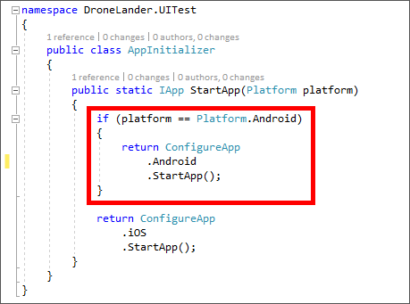
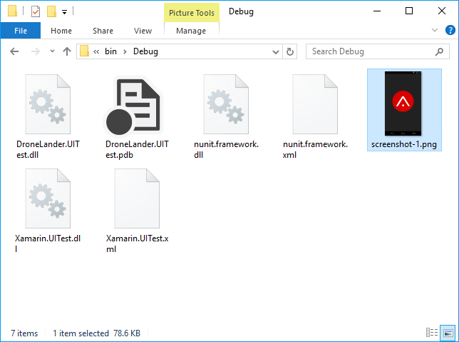
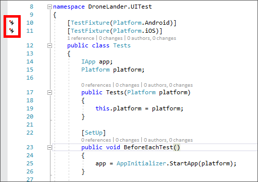
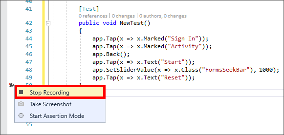
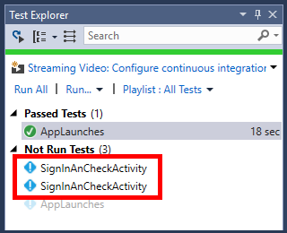
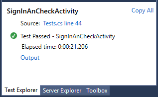
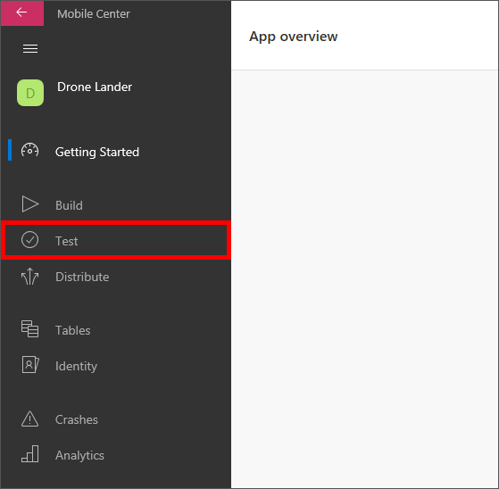
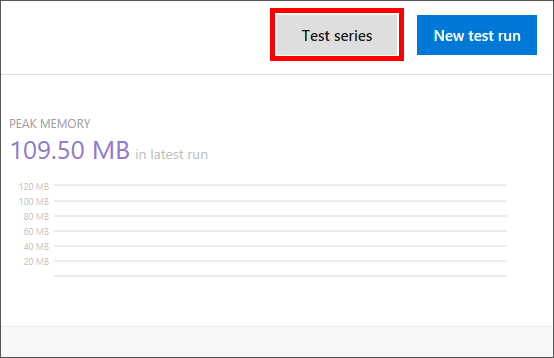
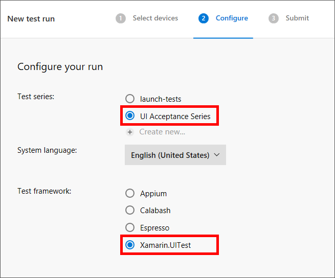

<a name="HOLTitle"></a>
# Operation Remote Resupply, Part 6 #

---

<a name="Overview"></a>
## Overview ##

In Part 4 of Operation Remote Resupply, you integrated both the build and distribute process of your development cycle with [Visual Studio Mobile Center](https://www.visualstudio.com/vs/mobile-center/ "Visual Studio Mobile Center") to create a seamless, automated process for building and distributing apps, triggered by release commits to a source code repository, such as GitHub. Although a simple "load test" was performed during this process, true, automated UI acceptance testing is not yet currently part of the lifecycle.

Although there are many types of tests that could, and should, be performed before your app is distributed to real users, such as unit, component, and integration testing, UI acceptance testing is a critical component of creating a well-testing and polished user experience, and is typically at the "top of the testing pyramid" providing incredible value to the overall understanding of how your app behaves and performs.   

[Xamarin.UITest](https://developer.xamarin.com/guides/testcloud/uitest/ "Xamarin.UITest") is an automation library and testing framework, designed specifically to meet these needs, based on the open source [Calabash](http://calaba.sh/ "Calabash") initiative and leveraging the power of the [NUnit](http://www.nunit.org/ "NUnit") testing framework. Xamarin.UITest enables both scripted and recorded UI acceptance tests to be created, automated, and run against iOS and Android devices. Xamarin.UITest can also be tightly integrated with Xamarin.Forms, Xamarin.iOS, and Xamarin.Android projects, and used with iOS and Android projects written in other languages, such as Objective-C/Swift and Java. 

In this lab, you will use Xamarin.UITest to add scripted and recorded UI acceptance tests to the Android version of the Drone Lander solution, as well as integrate automated UI acceptance tests into your existing Visual Studio Mobile Center Build and Distribute lifecycle configured in an earlier lab.   

<a name="Objectives"></a>
### Objectives ###

In this lab, you will learn how to:

- Add a Xamarin UI Test project to a Xamarin Forms solution
- Write cross-platform UI acceptance test scripts
- Use the Xamarin Test Recorder to record scripts 
- Integrate automated UI tests with Visual Studio Mobile Center

<a name="Prerequisites"></a>
### Prerequisites ###

The following are required to complete this lab:

- [Visual Studio Community 2017](https://www.visualstudio.com/vs/) or higher
- A computer running Windows 10 that supports hardware emulation using Hyper-V. For more information, and for a list of requirements, see https://msdn.microsoft.com/en-us/library/mt228280.aspx. 

If you wish to build and run the iOS version of the app, you also have to have a Mac running OS X 10.11 or higher, and both the Mac and the PC running Visual Studio 2017 require further configuration. For details, see https://developer.xamarin.com/guides/ios/getting_started/installation/windows/.

>Although Xamarin iOS projects can be be configured for, and integrated with, Xamarin.UITest, it is not possible to run actual tests against iOS apps in Visual Studio or on Windows. Running tests against iOS requires both a Mac running OS X 10.11 or higher, and Visual Studio 2017 for Mac.

---

<a name="Exercises"></a>
## Exercises ##

This lab includes the following exercises:

- [Exercise 1: Add a Xamarin.UITest project to a Xamarin Forms solution](#Exercise1)
- [Exercise 2: Write cross-platform UI test scripts](#Exercise2)
- [Exercise 3: Use the Xamarin Test Recorder to record scripts](#Exercise3)
- [Exercise 4: Integrate automated UI tests with Visual Studio Mobile Center](#Exercise4)
  
Estimated time to complete this lab: **45** minutes.

<a name="Exercise1"></a>
## Exercise 1: Add a Xamarin.UITest project to a Xamarin Forms solution ##
 
Although testing can be integrated into your development lifecycle at any time, the best time get started with testing, including UI testing, is during the development phase of a mobile app. Automated tests are typically "iterative" meaning they are often written as app features are being developed, and then adjusted and enhanced over the life of an app.

A Xamarin.UITest project can easily be added to an existing solution, and then a few simple steps taken to ensure your Android and iOS project are integrated into the testing process.

In this exercise you will add a Xamarin.UITest project to the **DroneLander** solution you have been developing, as well as confirming configuration and readiness for running UI tests. 

1. In Visual Studio 2017, open the **Drone Lander** solution created in the previous lab.

1. In Solution Explorer, right-click the **DroneLander** solution and use the **Add** > **New Project** command to add a **UI Test App (Xamarin.UITest | Cross-Platform)** project named "DroneLander.UITest" to the solution. 
 
	

    _Adding a new Xamarin.UITest project to the DroneLander solution_

1. In Solution Explorer, right-click the **DroneLander.UITest** project and select **Manage NuGet Packages for Solution...**, ensure the "Installed" tab is active, select the **Xamarin.UITest** package and click **Update** to install the **latest stable version** of Xamarin.UITest.

	

    _A blank Xamarin Workbook in the Android emulator_

1. Repeat this process for the **NUnitTestAdapter** package, updating the NUnitTestAdapter package to the **latest stable version**.

	**NOTE: DO NOT UPDATE the NUnit package. Xamarin.UITest do not work with NUnit version 3.0 or higher, and required a version of 2.6x in order to function properly.**

1. Notice the **AppInitializer.cs** and **Tests.cs** files that get created as part of the Xamarin.UITest project. These are the files you will be working in for the remainder of this exercise. The AppInitializer.cs file contains logic for configuring and activating platform-specific versions of your app, and Tests.cs will contain any actual test logic added to the project.

1. Open **AppInitializer.cs** and locate the Android-specific platform ```ConfigureApp``` logic. Code in the ```AppInitializer``` class is specific to either Android or iOS.
	 
	

    _The Android-specific platform ConfigureApp logic_

	To instruct Xamarin.UITest to run tests against a specific app you need to provide either a **file path** or a **package name** to the ConfigureApp method. You will be using the more straightforward package name method.

1. Open **Properties** > **Android Manifest** in the **DroneLander.Android** project and verify that the **Package name** is set to "com.traininglabs.dronelander". 

	

    _Verifying the Android package name_

	>You can technically use any name for the Android package name, however following the standard lowercase "reverse-domain" lookup method is preferred.

1. Add the following single line of code directly above the call to the ```StartApp``` method to configure the location of the Android version of Drone Lander.

	```C#
	.InstalledApp("com.traininglabs.dronelander")
	```
	 
	

    _Setting the InstalledApp property to the app package name_

1. Ensure that the Android project is selected as the startup project by right-clicking the **DroneLander.Android** project in Solution Explorer and selecting **Set as StartUp Project**, then launch the Android version of Drone Lander in the selected Android emulator.

1. Open the "Test Explorer" by using the **Test** > **Windows** > **Test Explorer** command from the Visual Studio IDE, wherein you will see a default "AppLaunches" test displayed for both Android and iOS devices under the "Not Run Tests" grouping. 
	 
	

    _The default AppLaunches tests in Test Explorer_

	>If you do not see the AppLaunches test entires in Test Explorer, use the Rebuild Solution command on the **DroneLander** solution to initialize your tests.

1. Right-click the first **AppLaunches** entry and select **Open Tests** to view the C# code associated with the ```AppLaunches``` test in the Test.cs file and observe the use of use of the ```[Test]``` attribute on the **AppLaunches** method. This attribute marks a method as a callable entry point for an NUnit test and exposes it to the Xamarin.UITest platform for execution. Other attributes, such as ```[StartUp]``` and ```[TearDown]``` are also useful attributes when working with Xamarin.UITests. 

1. When a Xamarin.UITest project is created, the default **AppLaunches** method contains a single call to the ```Screenshot``` method. The Screenshot method simply creates a screenshot of an app at any given point in a test script. This code was added by when you create the DroneLander.UITest project.

	

    _The Android AppLaunches method in Test.cs_

	By default, a screenshot is not stored locally. To make it easier to view during testing you need to add one more parameter to the ```ConfigureApp``` method in the ```AppInitializer``` class.

1. Open **AppInitializer.cs** and add the following single method directly below the **InstalledApp** method added earlier in this exercise to instruct the test to save screenshots locally:

	```C#
	.EnableLocalScreenshots()
	```
	
	With the location of your package assigned, and instructions to save screenshots locally, you're ready to start running UI tests against the Android version of Drone Lander.

1. Once more, right-click the first **AppLaunches** entry and select **Run Selected Tests** to run the AppLaunches test for the Android version of Drone Lander.
1. Activate the Android emulator and notice Drone Lander is automatically loaded, and then after a short delay, "Test Explorer" (in Visual Studio) displays successful run information for the AppLaunches test.

	

    _The Android AppLaunches method in Test.cs_

1. By default, screenshots created during test runs are saved locally to the current build folder in the test project. To validate the completion of the test run, check the availability of a screenshot by using the **Open Folder in File Explorer** command on the **DroneLander.UITest** project, navigate into the **bin** > **Debug** folder to view **screenshot-1.png**.

	

    _Viewing screenshot-1.png created by the AppLaunches test run_

You now have a Xamarin.UITest project successful added to your solution, and the Android version of Drone Lander configured for running automated UI tests.

In the next exercise you will be manually creating testing scripts that can run on both Android and iOS devices.

<a name="Exercise2"></a>
## Exercise 2: Write cross-platform UI test scripts ##

Although a simple test script was generated for you when you created the DroneLander.UITest project, taking a screenshot of the app really doesn't provide much value, in and of itself. Since the Xamarin.UITest platform is based on Calabash, you can take advantage of a full set of APIs to create meaning scripts that perform automated actions and interact with your UI, just as if a real user where using your app.

In this exercise you will be adding code to the AppLaunches tests to perform simple actions using the powerful APIs available in the Xamarin.UITest framework.

1. Open the **DroneLander** solution in Visual Studio 2017, if not already open from previous exercise.
1. Open **Tests.cs** in the **DroneLander.UITest** project and replace the code in the **AppLaunches** method with the following code:

	```C#
	app.Tap(x => x.Button("Start"));
    app.Screenshot("The app in progress.");
	``` 

	The first line of code demonstrates how simple it is to invoke a ```Tap``` event on a button, by querying the UI for a button labeled as "Start" and then performing a ```Tap``` event. Since the app will be in progress at the time a screenshot is created, we can change the step title of the screenshot to something more meaningful, such as "The app in progress".

1. Right-click the first **AppLaunches** entry and select **Run Selected Tests** to run the updated AppLaunches test for the Android version of Drone Lander.
1. Activate the Android emulator and notice Drone Lander is automatically loaded, and then after a short delay, the Start button is automatically tapped and a simulated landing session begins.

	

    _Testing of Drone Lander being automated by the updated AppLaunches method_

1. In Drone Lander, tap **Reset** to end the simulated landing session.
1. Navigate again into the **bin** > **Debug** folder to view **screenshot-1.png** and notice the screenshot correctly captures the state of the app immediately following the start of a landing attempt.

	Xamarin.UITest scripts are also able to interact with the device itself, for example by setting device orientation, adjusting volume, or even dismissing a soft keyboard.

1. To experiment with device interaction, insert the following lines of code directly below the call to **app.Screenshot**:

	```C#
    app.Flash(x => x.Text("Sign In"));
    app.SetOrientationLandscape();
    app.PressVolumeDown();
    app.PressVolumeDown();
    app.SetOrientationPortrait();
    app.Flash(x => x.Button("Reset"));
    app.PressVolumeUp();
    app.PressVolumeUp();
	```
	This code perform the following additional sequential steps: 
	
	- "Flash" the Sign In button temporarily
	- Set the device orientation to landscape
	- Turn the volume down two levels
	- Set the device orientation back to portrait
	- "Flash" the Reset button temporarily
	- Turn the volume back up two levels.

	

    _Automation of voume adjustment in a test script_

1. Right-click the first **AppLaunches** entry and select **Run Selected Tests** to run the updated AppLaunches test for the Android version of Drone Lander, then immediately switch to the Android emulator to observe the automated test in action.

	>Since these steps were automated, they all move quickly. Keep in mind, since you are still working with the Xamarin platform, methods available in the .NET Framework are also available for using in a Xamarin.UITest project, such as ```Thread.Sleep```, in order to simulate delays. 

In this exercise you had some practice interacting with an app via test script methods, however true, comprehensive testing often involves numerous, dependent steps. Manually creating these scripts can be time consuming and prone to errors. Wouldn't it be great if you could just "record" a full automation UI test and have it played back? With the Xamarin Test Recorder you can do just that.

In the next exercise you will be using the Xamarin Test Recorder to record UI automation tests and running these tests as additional NUnit test methods.

<a name="Exercise3"></a>
## Exercise 3: Use the Xamarin Test Recorder to record scripts ##

Creating automated UI tests can be a huge endeavor, requiring manual interaction with a mobile app in order to capture and identify real user interaction in an app. The [Xamarin Test Recorder](https://developer.xamarin.com/guides/testcloud/testrecorder/ "Xamarin Test Recorder") is a stand alone Visual Studio 2017 extension that can "record" how a user interacts with an application, and create automated tests in C# based on those interactions.

In this exercise, you will install the Xamarin Test Recorder and record automation tests that can be run locally, or integrated with a lifecycle by submitted them to [Xamarin Test Cloud](https://www.xamarin.com/test-cloud "Xamarin Test Cloud") or Visual Studio Mobile Center.

1. Install the Xamarin Test Recorder by using the **Tools** > **Extensions and Updates** command in the Visual Studio IDE to search for "xamarin test recorder" in the **Online** > **Visual Studio Marketplace**.

	

    _Downloading the Xamarin Test Recorder extension_

1. Close Visual Studio 2017 to allow the Xamarin Test Recorder extension to install, and then reopen the **Drone Lander** solution after installation is complete. 
1. Open **Tests.cs** in the **DroneLander.UITest** project and observe the new icons in the left margin well of the page. These icons indicate Xamarin Test Recorder actions that can be taken for both the Android and iOS projects associated as NUnit ```[TestFixtures]```. The TextFixture attribute simply indicates that a class file contains callable test methods. 

	

    _The Xamarin Test Recorder icons in Tests.cs_

	As a reminder, since Xamarin.UITest can only run tests on Android devices when using Visual Studio 2017 on Windows, you will only be recording and running tests in an Android emulator.

1. The Xamarin Test Recorder is unable to use the Mono Shared Runtime typically used when you are in Debug mode. The simplest way to allow recording is to change your current build configuration to Release mode, by selecting **Release** from the Visual Studio IDE build configuration selector.

	

    _Changing the current build configuration to Release mode_

1. Right-click the **DroneLander.Android** project and select **Build** to build a release version of Drone Lander.
1. To begin recording UI activities, still in **Test.cs**, click the recording icon to the left of ```[TextFixture(Platform.Android)]``` and then select **Record New Test** > **Build DroneLander.Android project**.

	

    _Starting a new recording session for the Drone Lander Android app_

	After a short delay Xamarin Test Recorder will beging connecting to the emulator, as indicated in the bottom left corner of the Visual Studio IDE status bar, and then launch the app in the emulator.
	
	

    _Connecting Xamarin Test Recorder to an emulator session_

1. **Wait for the recorder sessions status to change from "Connecting to app..." to "Connected".** (This may take up to 30 seconds, depending on the emulator you have selected.)
1. When connection to the emulator has been made, switch to the emulator and begin recording actions with the Xamarin Test Recorder by performing the following steps, **in sequence**:

	- Tap **Sign In**, to begin authentication
	- Enter you Microsoft account **email address**
	- Tap the **Next** button
	- Enter you Microsoft account **password**
	- Tap the **Sign In** button, to authenticate and return to the main screen
	- Tap **Activity**, to view landing activity
	- Tap the device **hardware back button**
	- Tap **Start**, to begin a landing session
	- Adjust the **Throttle** all the way to the right
	- Tap **Reset** 
  
1. Return to Visual Studio 2017 and observe a new method named "NewTest" has been created in **Tests.cs**, and populated with steps corresponding to the app UI actions you performed in the previous step.

	>Steps related to entering Microsoft account information in the WebView control may not have been captured. Capturing these steps often depends on the speed of the dialog load process and other factors unrelated to Xamarin.UITest.

	

    _Ending a Xamarin Test Recorder session_

1. In Test Explorer, right-click the **NewTest** entry for the **Android version** of the test and select **Run Selected Tests** to run the updated NewTest test in the emulator, then immediately switch to the Android emulator to observe the automated test in action.

	Notice the test doesn't quite reflect exactly what a user would do, and may even "hang" at the Microsoft account authorization step. Since the steps are sequential, and do not take into account page rendering and content availability, you need to add a few steps to provide a more realistic use case.

1. Change the name of the **NewTest** method to something more descriptive, such as "SignInAnCheckActivity".
1. If the test code generated **does not** include steps referencing the ```WebView``` class, insert the following lines of code directly below the initial **x.Marked("Sign In")** step to automate the Microsoft account authorization process:

	```C#
	app.WaitForElement(c => c.WebView().Css("INPUT#i0116"));
    app.EnterText(x => x.WebView().Css("INPUT#i0116"), "YOUR_MICROSOFT_ACCOUNT_EMAIL_ADDRESS");
    app.Tap(x => x.WebView().Css("INPUT#idSIButton9"));
    app.EnterText(x => x.WebView().Css("INPUT#i0118"), "YOUR MICROSOFT_ACCOUNT_PASSWORD");
    app.Tap(x => x.WebView().Css("INPUT#idSIButton9"));
	```
1. If the test code generated **does** include references to the ```WebView``` class, insert the following single line of code directly below the initial **Sign In** step to wait for the authentication dialog to render, prior to automating the Microsoft account authorization process:

	```C#
	app.WaitForElement(c => c.WebView().Css("INPUT#i0116"));
	```
	The Xamarin.UITest **WaitForElement** method provides and easy mechanism for instructing your script to "wait for" a UI element to become available before proceeding to the next step. In the code above, the script will essentially wait for the authentication dialog to render before moving to the next step.

	

    _The updated code to automate account authorization_

1. In the script, replace the value of "YOUR_MICROSOFT_ACCOUNT_EMAIL_ADDRESS" with your **Microsoft account email address**, as well as the value of "YOUR MICROSOFT_ACCOUNT_PASSWORD" with your **Microsoft account password**.

	>In production testing scenarios you will want to create testing accounts to use in your scripts, and avoid using personal account tied to specific users.
	
	Since the Test Recorder doesn't record or reproduce "delays" when recording, it's often helpful to force a delay in a script, or wait for a UI control to become available before moving to the next step. You may have noticed the recorded code immediately performs a page back action after loading landing activity. To ensure page content gets loaded before continuign to the next step, you can, again, use the ```WaitForElement``` method.

1. Insert the following single line of code directly below the **x.Marked("Activity")** tap event, to instruct the script to wait for a text value of "Kaboom" to display on the landing activity page before continuing:

	```C#
	app.WaitForElement(x => x.Text("Kaboom"));
	```
	Since your recording also reproduced a Tap event on the Reset button immediately following the increase in Throttle, in may be more realistic to add a delay to allow the landing to run for a period of time before resetting the landing session.

1. Add the following single line of code directly below the **x.Class("FormsSeekBar")** slider change event to force a two-second delay using the standard .NET framework ```Thread.Sleep``` method:

	```C#
	 System.Threading.Thread.Sleep(2000);
	```

1. Right-click the **DroneLander.UITest** project and select **Rebuild** to rebuild the project and register the new test method with the Test Explorer.

	

    _The updated test methods in Test Explorer_

1. In Test Explorer, right-click the **SignInAnCheckActivity** entry for the **Android version** of the test and select **Run Selected Tests** to run the updated SignInAnCheckActivity test in the emulator, then immediately switch to the Android emulator to observe the automated test in action.

	>You can easily determine whether a test method targets Android or iOS by hovering over the entry in Test Explorer and viewing the tooltip referencing the platform.

1. Observe the fully automated process of authenticating a user, viewing landing activity, start an landing attempt, adjusting the throttle value, and then resetting the session. When the automated test is complete, status information will become available in the Test Explorer results pane with a status of "Test Passed".  

	

    _Successfully running the SignInAndCheckActivity test_

Seeing automated UI tests running live on a device or emulator is pretty amazing to watch, and you could, of course, run these tests again any number of devices, however running these tests still requires your time and effort. More importantly, you probably have a limited set of actual devices and emulators in your possession, and cannot realistically perform comprehensive testing against the hundreds or even thousands of device, screen, and form factor variations that are possible.

To fully automate the UI testing required against a wide variety of scenarios, services such a Xamarin Test Cloud and Visual Studio Mobile Center provide features to automate UI acceptance testing of mobile apps across hundreds of different devices, with thousands of variations.

In the final exercise you will be integrating the Xamarin.UITest automated UI acceptance tests you created in this lab into your existing Visual Studio Mobile Center Build and Distribute lifecycle configured in an earlier lab.

<a name="Exercise4"></a>
## Exercise 4: Integrate automated UI tests with Visual Studio Mobile Center ##

 

In this exercise will be adding the DroneLander.UITest project to your GitHub repo and integrating the automated project tests in the Mobile Center lifecycle to complete the full Build, Test, and Distribute process.

1. In Visual Studio 2017, open **Tests.cs** in the **DroneLander.UITest** project, and replace the code inside the **SignInAnCheckActivity** method with the following code:

	```C#
	app.Tap(x => x.Text("Start"));
    app.SetSliderValue(x => x.Class("FormsSeekBar"), 1000);
    System.Threading.Thread.Sleep(2000);
    app.Screenshot("Drone Lander in action");
    app.Tap(x => x.Text("Reset"));
	```
	>Since many third-party authentication services, including Microsoft accounts, often require two-factor authentication or secondary forms of sign in validation, you are removing code related to authentication to avoid any "false failures" during test runs, as well as adding the Screenshot method to capture the state of the UI during a landing attempt.
	
1. The SignInAnCheckActivity method now performs tasks associated with app launch, making the existing AppLaunches event no longer necessary. Still in **Tests.cs** remove the entire **AppLaunches** event, include the ```[Test]``` attribute.
	
	>Although you could technically leave the default AppLaunches event in place, the new SignInAnCheckActivity method performs start up and launch validation and make the AppLaunches event redundant.

1. Ensure you are still in **Release** mode configuration from the previous exercise, then right-click the **DroneLander.Android** project and use the **Archive...** command to create a Release version of the project package.
1. Still in Visual Studio, add your DroneLander.UITest project to your GitHub repo by clicking the GitHub **changes indicator** at the lower-right corner of the Visual Studio IDE status bar.

	

    _The Visual Studio GitHub changes indicator_

1. Enter a commit message such as "Added a new Xamarin.UITest project." then select **Commit All and Push** from the "Commit All" selector. 

	As you may recall from an earlier lab, your Drone Lander solution is integrated with GitHub, and any new commits will automatically trigger the Build and Distribute process. Xamarin.UITest is designed to seamlessly integrate into this process and function as the **Test** portion of a full Build, Test, Distribute lifecyle.

1. Open [Visual Studio Mobile Center app portal](https://mobile.azure.com/apps) in your browser and click the Android version of **Drone Lander** created in an earlier lab, then select the **Test** tab. 
 
	

    _Accessing the Test tab in Visual Studio Mobile Center_

	Although you may have activity from an earlier lab, the tests run during these sessions were simple "app launch" tests you designated as part of the Build and Distribute lifecycle. For real testing you will be integrating your Xamarin.UITest methods into the Build and Disribute process.

1. Click **Test Series** in the upper-left corner of the page to create a new test series definition, then click **Create new series**.

	

    _Accessing the Test tab in Visual Studio Mobile Center_

1. Enter "UI Acceptance Series" as the "New test series" name, then click **Create**. After a short delay your new test series will be created.

	

    _Accessing the Test tab in Visual Studio Mobile Center_

1. Close the dialog to be returned to the Mobile Center Test page, then click **New Test Run**.
1. On the "Select devices" step, select a single device, such as the "Google Pixel XL", then click **Select (1) device** at the bottom of the screen.

	

    _Selecting a target device for a new test run_

	>In real world testing you would like select a larger number of diverse devices for testing, however you should only select a single device for this step, as adding additional device requires additional processing time during acceptance test runs.

1. On the "Configure" tab, select **UI Acceptance Series** as the "Test series" and **Xamarin.UITest** as the "Test framework", then click **Next**.

	

    _Selecting a series and framework for testing_

1. Review the information on the final "Submit" step, observing the requirements to run specific command-line commands using the Mobile Center Command Line Interface (CLI) in the "Prerequities" panel. **Perform steps 1 and 2** to ensure you have both [Node.js](https://nodejs.org/en/ "Node.js") and the [Mobile Center CLI](https://docs.microsoft.com/en-us/mobile-center/cli/ "Mobile Center CLI") installed on your workstation.   

	

    _The Mobile Center automated test pre-requisites steps_

1. From the "Running tests" panel copy the Mobile Center CLI command and parameters by clicking **Copy to clipboard**.

	

    _Copying Mobile Center CLI command and parameters to the clipboard_

	These commands need to be run from the NuGet **packages** folder located in the root of **Drone Lander solution**. You can easily determine and navigate to this location in a command prompt window by using the Solution and File Explorer.

1. Open a command prompt and type in "cd " (as the change directory command), then right-click the **DroneLander** solution and use the **Open Folder in File Explorer** command to view the folder location on your file system.
1. Drag the **packages** folder **into the command window** to insert the full path to the packages folder, then press the **enter key** on your keyboard to change the working directory to the packages folder.
1. Paste the **contents of the clipboard** into the **command window**, being careful not to execute the command.
1. In the script, replace **pathToFile.apk** with the following command (**including** the quotation marks.) **This will be the location of your Android archive when you build it in Release mode.**

	```Text
	"..\DroneLander\DroneLander.Android\bin\Release\com.traininglabs.dronelander.apk"
	``` 
1. Replace **pathToUITestBuildDir** with the following command (again including quotation marks.) **This is the location of your Xamarin.UITest build directory.**

	```Text
	"..\DroneLander.UITest\bin\Release"
	```
1. Press the **enter key** on your keyboard to begin execution of the Mobile Center CLI commands.

	

    _Preparing and submitting acceptance tests via the Mobile Center CLI_

1. Return to the **Test** tab for the Android version of Drone Lander in the Mobile Center. After a short delay, the Mobile Center Test tab will start displaying the status of your acceptance test submission and run.

	

    _Test execution status in the Mobile Center during command-line execution_

1. Since Mobile Center is running your automated UI tests on a real device, this process **could take as long as 10 to 15 minutes to complete**. When the "Status" of the automated UI test run changes to "PASSED", select the list entry to view test run details.
1. Observe the correct timing of the screenshot (while a landing attempt is in progress) as well as the labeling of the screenshot as "Drone Lander in action."

	

    _A successful automated UI test in Visual Studio Mobile Center_

	For more detailed information about test runs on specific devices, you can click on Details and Logs to get complete device specifications, test log step details, and even full stack traces.

That's it, you did it! In this exercise you added automated UI acceptance testing to your Build and Distribute lifecycle in Visual Studio Mobile Center, automating your entire mobile app lifecycle in a few easy steps.

<a name="Summary"></a>
## Summary ##

That's it for Part 6 of Operation Remote Resupply. By combining the power of Xamarin.UITest, Test Recorder, and Visual Studio Mobile Center, your entire development lifecycle is now complete, and fully automated. The tests you created in this lab, although simple, can provide you with a solid foundation for creating more thorough, robust, and meaningful UI acceptance tests as you travel along on your mobile app development journey using the Xamarin platform and other tools in the Xamarin tool set.